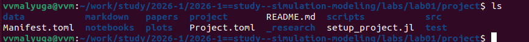
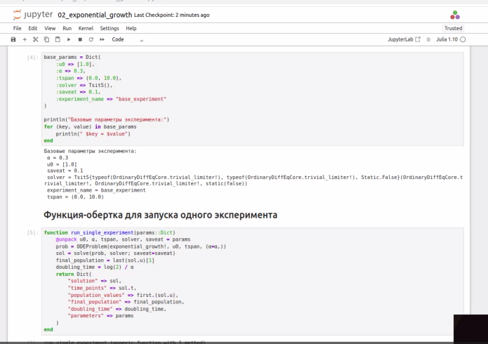
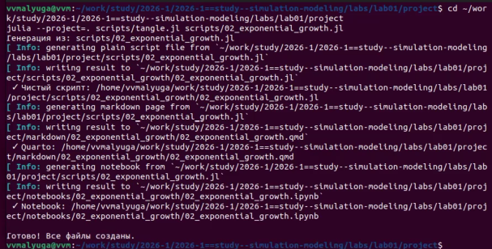
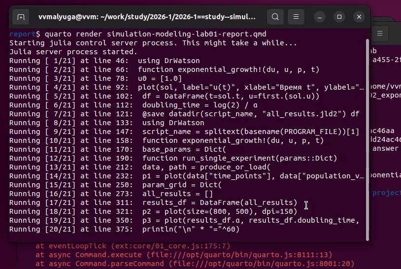

---
<<<<<<< HEAD
author:
  name: Малюга Валерия Васильевна
  degrees: студент
  email: 1132236050@rudn.ru
  affiliation:
    - name: Российский университет дружбы народов
title: "Лабораторная работа №1"
subtitle: "Подготовка стенда"
format:
  beamer:
    theme: metropolis
    aspectratio: 169
    section-titles: true
    lang: ru
    babel-lang: russian
    babel-otherlangs: english
    keep-tex: true
date: "2026-02-21"
=======
## Author
author:
  name: Дмитрий Сергеевич Кулябов
  degrees: DSc
  orcid: 0000-0002-0877-7063
  email: kulyabov-ds@rudn.ru
  affiliation:
    - name: Российский университет дружбы народов
      country: Российская Федерация
      postal-code: 117198
      city: Москва
      address: ул. Миклухо-Маклая, д. 6
## Title
title: Структура научной презентации
subtitle: Простейший вариант
license: CC BY
date: today
date-format: "YYYY-MM-DD" # Example: 2025-09-06
>>>>>>> develop
---

# Информация

## Докладчик

:::::::::::::: {.columns align=center}
::: {.column width="70%"}
<<<<<<< HEAD
  * Малюга Валерия Васильевна
  * студент
  * РУДН
:::
::: {.column width="30%"}

=======

  * Кулябов Дмитрий Сергеевич
  * д.ф.-м.н., профессор
  * профессор кафедры теории вероятностей и кибербезопасности
  * Российский университет дружбы народов им. П. Лумумбы
  * [kulyabov-ds@rudn.ru](mailto:kulyabov-ds@rudn.ru)
  * <https://yamadharma.github.io/ru/>

:::
::: {.column width="30%"}


>>>>>>> develop
:::
::::::::::::::

# Вводная часть

## Актуальность

<<<<<<< HEAD
- Экспоненциальный рост — базовая модель в биологии, финансах, эпидемиологии
- Литературное программирование повышает воспроизводимость исследований
- Julia + DrWatson + Literate автоматизируют документирование

## Цель и задачи

**Цель:** Исследовать модель $\frac{du}{dt} = \alpha u$ средствами литературного программирования

**Задачи:**
- Создать структуру проекта по Denote
- Реализовать модель на Julia
- Выполнить параметрическое исследование
- Сгенерировать отчет и презентацию

# Выполнение

## Структура проекта

{width=80%}

{width=80%}

## Установка пакетов

{width=80%}

{width=80%}

## Базовая модель

Код модели:
```julia
function exponential_growth!(du, u, p, t)
    α = p
    du[1] = α * u[1]
end
```

Результат: время удвоения = 2.31

{width=80%}

## Литературный стиль

{width=80%}

## Параметрическое исследование

Код для набора параметров:
```julia
param_grid = Dict(
    :α => [0.1, 0.3, 0.5, 0.8, 1.0],
    :u0 => [[1.0]],
    :tspan => [(0.0, 10.0)]
)
```

{width=80%}

## Результаты

| α | Время удвоения |
|---|---|
| 0.1 | 6.93 |
| 0.3 | 2.31 |
| 0.5 | 1.39 |
| 0.8 | 0.87 |
| 1.0 | 0.69 |

## График зависимости

{width=90%}

## Генерация артефактов

{width=80%}

## Компиляция отчета

{width=80%}


# Результаты

## Итог

 Создано рабочее пространство по Denote  
 Реализована модель на Julia  
 Выполнено параметрическое исследование  
 Применено литературное программирование  
 Сгенерированы отчет и презентация  

## Главное

**Модель экспоненциального роста успешно исследована, подтверждена теоретическая зависимость времени удвоения:** $T_2 = \ln(2)/\alpha$

# Ссылки

## Репозитории

- GitHub: [ссылка]
- GitVerse: [ссылка]
- Релиз v1.0.0: [ссылка]

## Скринкасты

- Rutube: [ссылка на плейлист]
- VKvideo: [ссылка на плейлист]
=======
- Важно донести результаты своих исследований до окружающих
- Научная презентация --- рабочий инструмент исследователя
- Необходимо создавать презентацию быстро
- Желательна минимизация усилий для создания презентации

## Объект и предмет исследования

- Презентация как текст
- Программное обеспечение для создания презентаций
- Входные и выходные форматы презентаций

## Цели и задачи

- Создать шаблон презентации в Markdown
- Описать алгоритм создания выходных форматов презентаций

## Материалы и методы

- Процессор `pandoc` для входного формата Markdown
- Результирующие форматы
	- `pdf`
	- `html`
- Автоматизация процесса создания: `Makefile`

# Создание презентации

## Процессор `pandoc`

- Pandoc: преобразователь текстовых файлов
- Сайт: <https://pandoc.org/>
- Репозиторий: <https://github.com/jgm/pandoc>

## Формат `pdf`

- Использование LaTeX
- Пакет для презентации: [beamer](https://ctan.org/pkg/beamer)
- Тема оформления: `metropolis`

## Код для формата `pdf`

```yaml
slide_level: 2
aspectratio: 169
section-titles: true
theme: metropolis
```

## Формат `html`

- Используется фреймворк [reveal.js](https://revealjs.com/)
- Используется [тема](https://revealjs.com/themes/) `beige`

## Код для формата `html`

- Тема задаётся в файле `Makefile`

```make
REVEALJS_THEME = beige
```
# Результаты

## Получающиеся форматы

- Полученный `pdf`-файл можно демонстрировать в любой программе просмотра `pdf`
- Полученный `html`-файл содержит в себе все ресурсы: изображения, css, скрипты

# Элементы презентации

## Актуальность

- Даёт понять, о чём пойдёт речь
- Следует широко и кратко описать проблему
- Мотивировать свое исследование
- Сформулировать цели и задачи
- Возможна формулировка ожидаемых результатов

## Цели и задачи

- Не формулируйте более 1--2 целей исследования

## Материалы и методы

- Представляйте данные качественно
- Количественно, только если крайне необходимо
- Излишние детали не нужны

## Содержание исследования

- Предлагаемое решение задач исследования с обоснованием
- Основные этапы работы

## Результаты

- Не нужны все результаты
- Необходимы логические связки между слайдами
- Необходимо показать понимание материала


## Итоговый слайд

- Запоминается последняя фраза. © Штирлиц
- Главное сообщение, которое вы хотите донести до слушателей
- Избегайте использовать последний слайд вида *Спасибо за внимание*

# Рекомендую

## Принцип 10/20/30

  - 10 слайдов
  - 20 минут на доклад
  - 30 кегль шрифта

## Связь слайдов

::: incremental

- Один слайд --- одна мысль
- Нельзя ссылаться на объекты, находящиеся на предыдущих слайдах (например, на формулы)
- Каждый слайд должен иметь заголовок

:::

## Количество сущностей

::: incremental

- Человек может одновременно помнить $7 \pm 2$ элемента
- При размещении информации на слайде старайтесь чтобы в сумме слайд содержал не более 5 элементов
- Можно группировать элементы так, чтобы визуально было не более 5 групп

:::

## Общие рекомендации

::: incremental

- На слайд выносится та информация, которая без зрительной опоры воспринимается хуже
- Слайды должны дополнять или обобщать содержание выступления или его частей, а не дублировать его
- Информация на слайдах должна быть изложена кратко, чётко и хорошо структурирована
- Слайд не должен быть перегружен графическими изображениями и текстом
- Не злоупотребляйте анимацией и переходами

:::

## Представление данных

::: incremental

- Лучше представить в виде схемы
- Менее оптимально представить в виде рисунка, графика, таблицы
- Текст используется, если все предыдущие способы отображения информации не подошли

:::
>>>>>>> develop
