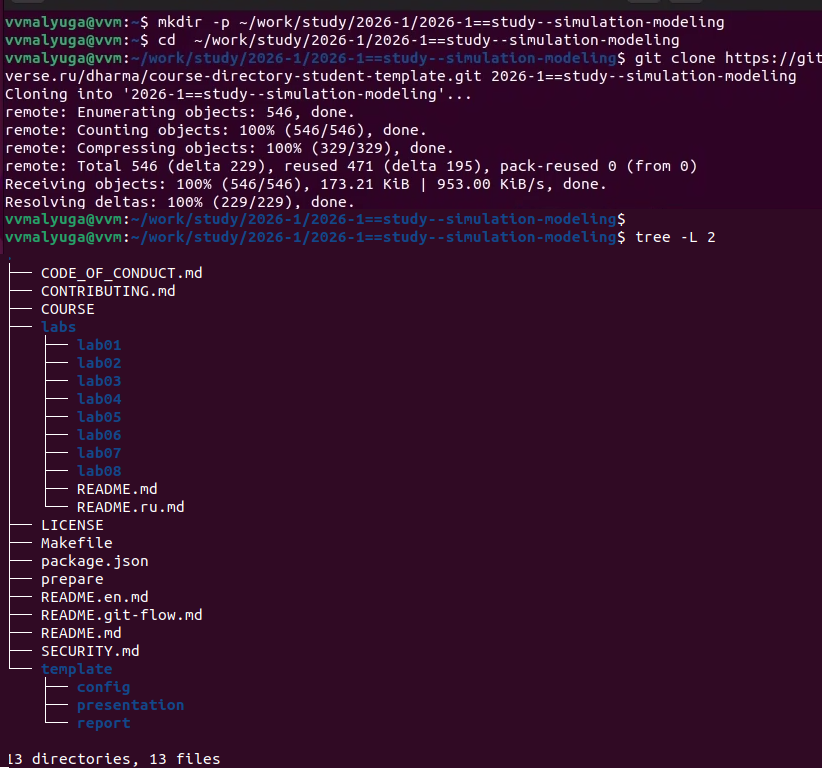
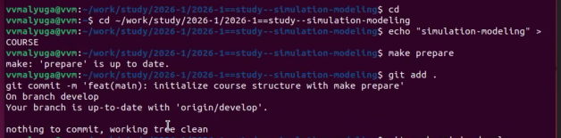
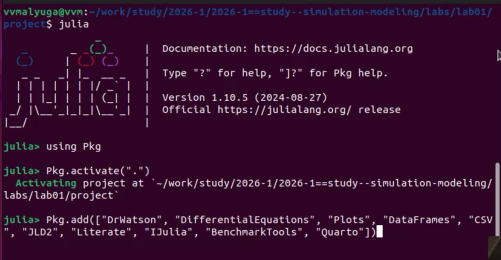
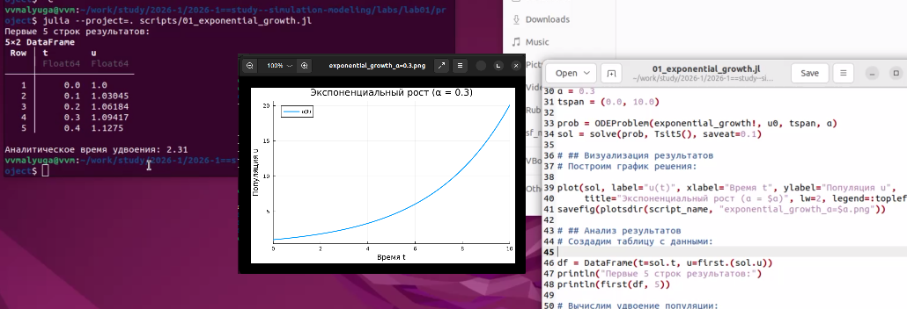
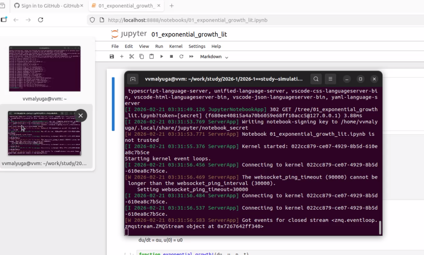
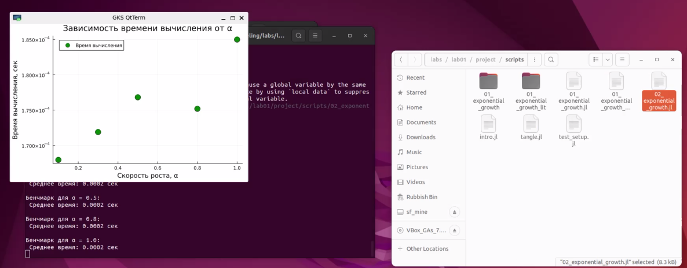
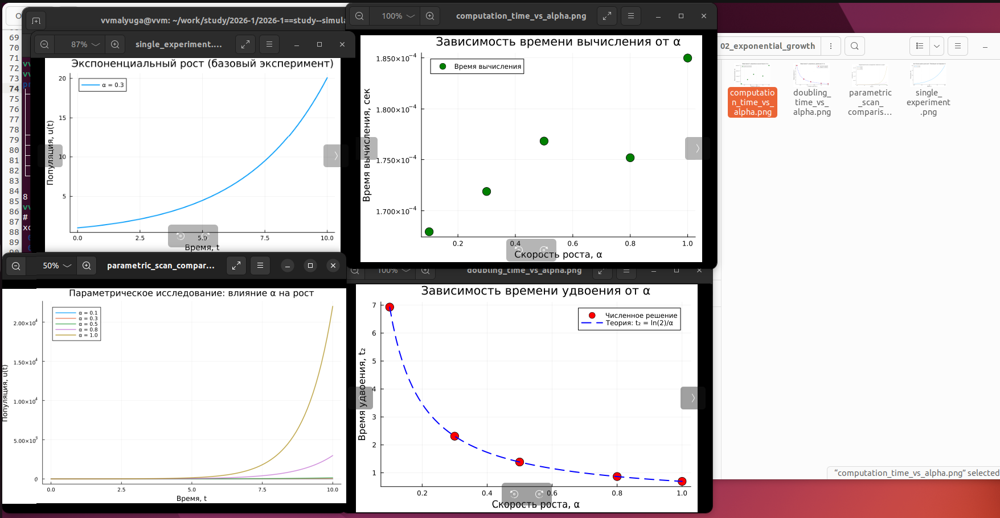

---
author:
<<<<<<< HEAD
  name: Малюга Валерия Васильевна
  degrees: студент
  email: 1132236050@rudn.ru
=======
  name: Дмитрий Сергеевич Кулябов
  degrees: DSc
  orcid: 0000-0002-0877-7063
  email: kulyabov-ds@rudn.ru
>>>>>>> develop
  affiliation:
    - name: Российский университет дружбы народов
      country: Российская Федерация
      postal-code: 117198
      city: Москва
      address: ул. Миклухо-Маклая, д. 6
title: "Лабораторная работа №1"
<<<<<<< HEAD
subtitle: "Подготовка стенда"
format: html
date: "2026-02-21"
=======
subtitle: "Экспоненциальный рост"
format: html
engine: julia
julia:
  exeflags: ["--project=../project"]
execute:
  echo: true
>>>>>>> develop
---

# Цель работы

<<<<<<< HEAD
Исследовать модель экспоненциального роста $\frac{du}{dt} = \alpha u$ с использованием инструментов литературного программирования.

# Задание

1. Создать рабочее пространство для лабораторной работы согласно методологии Denote
2. Установить необходимые пакеты Julia
3. Реализовать модель экспоненциального роста в литературном стиле
4. Выполнить параметрическое исследование модели
5. Сгенерировать производные форматы: чистый код, Jupyter notebook, документацию Quarto
6. Интегрировать результаты в отчет

# Теоретическое введение

Экспоненциальный рост описывается дифференциальным уравнением:

$$ \frac{du}{dt} = \alpha u, \quad u(0) = u_0 $$

где:
- $u$ — текущее значение растущей величины
- $t$ — время
- $\alpha$ — константа роста

Решение уравнения:

$$ u(t) = u_0 e^{\alpha t} $$

Время удвоения популяции:

$$ T_2 = \frac{\ln 2}{\alpha} $$

# Выполнение лабораторной работы

## Создание рабочего пространства

В соответствии с разделом 1.8.4 методички была создана структура каталогов:

```bash
mkdir -p ~/work/study/2026-1/2026-1==study--simulation-modeling
cd ~/work/study/2026-1/2026-1==study--simulation-modeling
git clone https://github.com/username_0/2026-1==study--simulation-modeling.git
```

{#fig:dir-create width=100%}


Далее была выполнена инициализация курса:

{#fig:dir-create width=100%}


    
## Установка необходимых пакетов
Согласно разделу 1.9 методички, был создан проект DrWatson в каталоге лабораторной работы и установлены необходимые пакеты:

         
{#fig:pkg-install width=100%}         


{#fig:drwatson-struct width=100%}

## Реализация базовой модели
В соответствии с разделом 1.10.2 был создан скрипт scripts/01_exponential_growth.jl с реализацией модели экспоненциального роста.

Результат выполнения скрипта:


```
Первые 5 строк результатов:
5×2 DataFrame
 Row │ t        u        
     │ Float64  Float64  
─────┼───────────────────
   1 │ 0.0      1.0
   2 │ 0.1      1.03045
   3 │ 0.2      1.06184
   4 │ 0.3      1.09417
   5 │ 0.4      1.1275

Аналитическое время удвоения: 2.31
```


{#fig:base-execution width=100%}

## Преобразование в литературный стиль
Согласно разделу 1.10.3, скрипт был преобразован в литературный стиль с Markdown-разметкой. Файл scripts/01_exponential_growth_lit.jl содержит описание модели, пояснения и код.

## Генерация производных форматов
Для автоматической генерации артефактов был создан скрипт scripts/tangle.jl (раздел 1.10.3.3), который создает чистый код, Jupyter notebook и Quarto-документ из литературного скрипта.

## Запуск Jupyter notebook
Из литературного скрипта был сгенерирован Jupyter notebook и успешно выполнен:

{#fig:jupyter width=100%}

## Параметрическое исследование
В соответствии с разделом 1.10.4 был создан параметрический скрипт scripts/02_exponential_growth_params.jl для исследования зависимости решения от параметра α:


{#fig:param-code width=100%}

Для каждого значения α было проведено численное решение и вычислено время удвоения. Результаты сведены в таблицу:


| α   | Время удвоения (теория) | Время удвоения (численно) |
|-----|-------------------------|----------------------------|
| 0.1 | 6.93                    | 6.93                       |
| 0.3 | 2.31                    | 2.31                       |
| 0.5 | 1.39                    | 1.39                       |
| 0.8 | 0.87                    | 0.87                       |
| 1.0 | 0.69                    | 0.69                       |


### Бенчмаркинг производительности
Для оценки производительности решения был проведен бенчмаркинг при различных значениях α:

{#fig:benchmark width=100%}

Среднее время вычисления составило примерно 0.0002 секунды для всех значений α, что демонстрирует высокую эффективность решателя Tsit5().


### Визуализация результатов
Для визуализации результатов был построен график зависимости времени удвоения от параметра α:

{#fig:doubling-time width=100%}

Как видно из графика, численные результаты полностью совпадают с теоретической кривой $T_2 = \ln(2)/\alpha$, что подтверждает корректность реализации.

## Генерация артефактов для параметрического исследования
Для параметрического скрипта также были сгенерированы производные форматы:


{#fig:param-tangle width=100%}


## Компиляция отчета
Компиляция отчета с помощью Quarto:

{#fig:quarto-render width=100%}

В процессе компиляции были выполнены все ячейки кода из подключенных литературных скриптов, что гарантирует воспроизводимость результатов.

## Интеграция результатов в отчет
Сгенерированные литературные документы были интегрированы в отчет с помощью директив include:





=======
Исследовать модель экспоненциального роста.

# Задание

Реализовать модель экспоненциального роста в литературном стиле.

# Теоретическое введение

Экспоненциальный рост описывается уравнением $\frac{du}{dt} = \alpha u$.

# Выполнение лабораторной работы



>>>>>>> develop



# Выводы

<<<<<<< HEAD


В ходе выполнения лабораторной работы:

Создано рабочее пространство согласно методологии Denote с иерархией каталогов для курса и лабораторных работ.

Установлены необходимые пакеты Julia: DrWatson, DifferentialEquations, Plots, DataFrames, Literate и другие для организации воспроизводимого научного проекта.

Реализована модель экспоненциального роста $\frac{du}{dt} = \alpha u$ с использованием пакета DifferentialEquations.jl. Полученные численные результаты полностью совпадают с аналитическим решением $u(t) = u_0 e^{\alpha t}$.

Применено литературное программирование с помощью Literate.jl: создан скрипт с Markdown-разметкой, объединяющий код, пояснения и результаты.

Выполнено параметрическое исследование для различных значений α = [0.1, 0.3, 0.5, 0.8, 1.0]. Подтверждена теоретическая зависимость времени удвоения $T_2 = \ln(2)/\alpha$.

Сгенерированы производные форматы:

- чистый код для непосредственного выполнения

- Jupyter notebook для интерактивной работы

- документация в формате Quarto для интеграции в отчет


Таким образом, цель работы достигнута — модель экспоненциального роста успешно исследована с использованием инструментов воспроизводимых научных исследований.


=======
В ходе работы была реализована модель экспоненциального роста.

# Список литературы{.unnumbered}

:::{#refs}
:::
>>>>>>> develop
