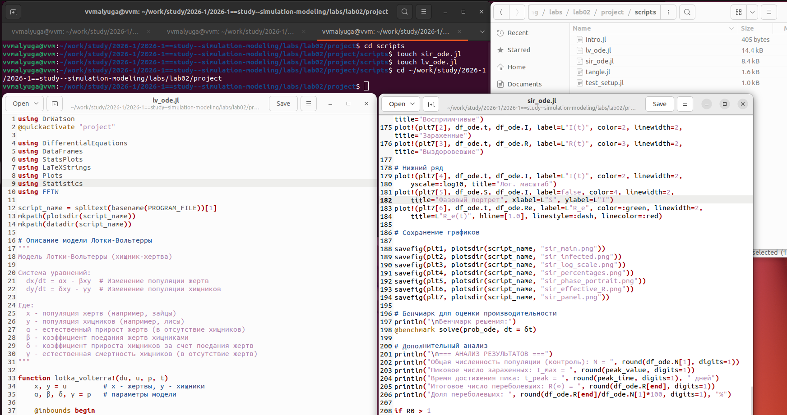
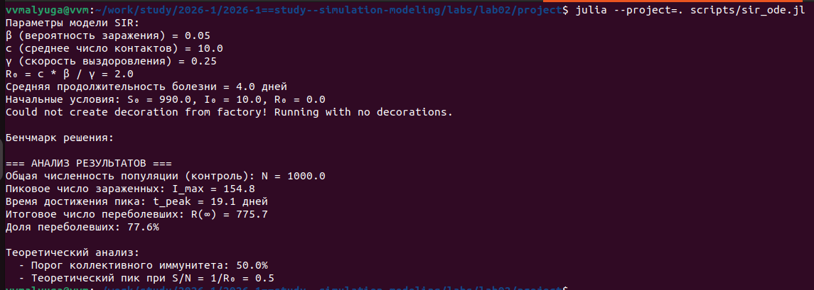
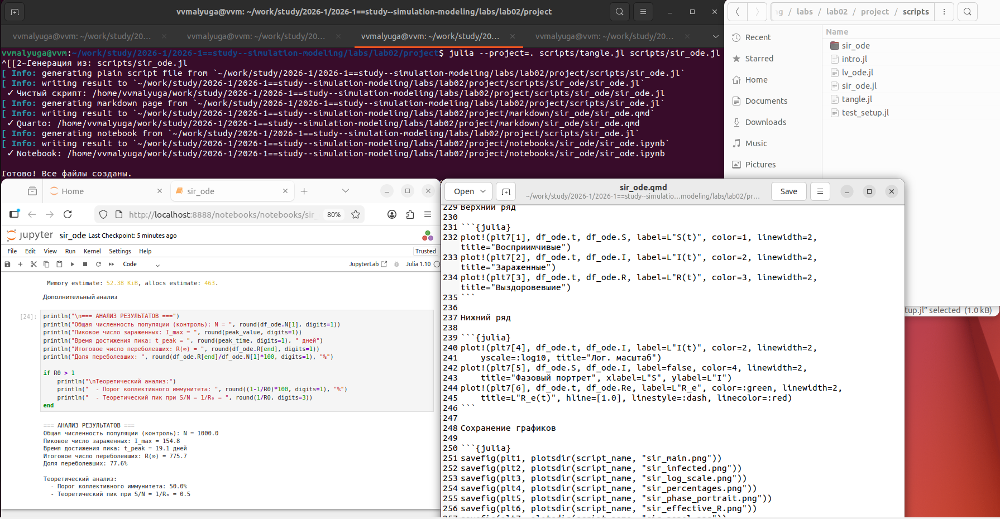
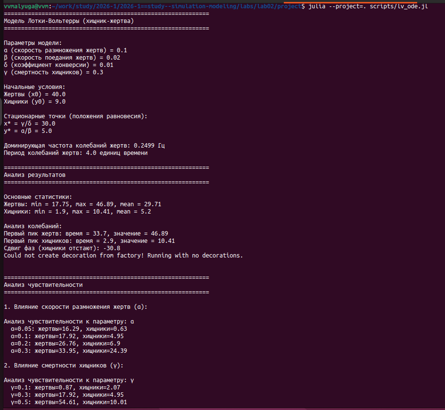
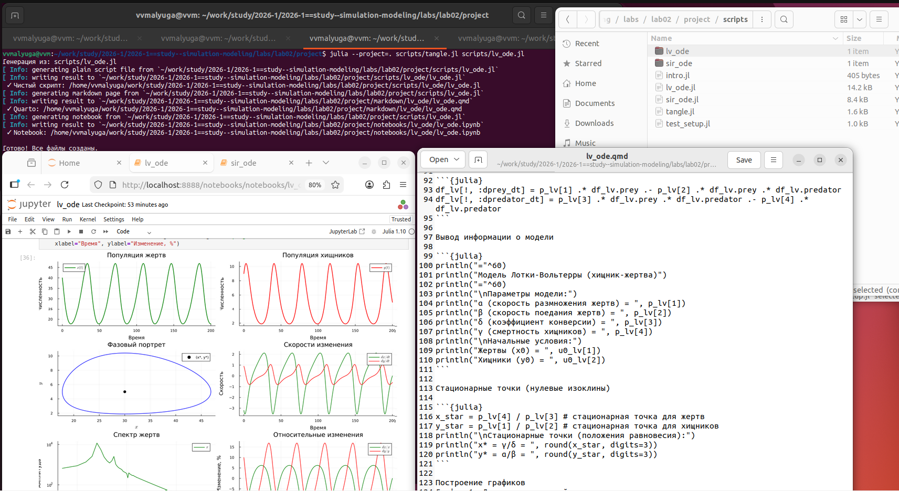

---
## Author
author:
<<<<<<< HEAD
  name: Дмитрий Сергеевич Кулябов
  degrees: DSc
  orcid: 0000-0002-0877-7063
  email: kulyabov-ds@rudn.ru
=======
  name: Малюга Валерия Васильевна
  email: 1132236050@rudn.ru
>>>>>>> develop
  affiliation:
    - name: Российский университет дружбы народов
      country: Российская Федерация
      postal-code: 117198
      city: Москва
      address: ул. Миклухо-Маклая, д. 6
<<<<<<< HEAD

## Title
title: "Шаблон отчёта по лабораторной работе"
subtitle: "Простейший вариант"
=======
format: 
  pdf:
    pdf-engine: xelatex
    mainfont: "DejaVu Serif"
    monofont: "DejaVu Sans Mono"
    fontsize: 12pt
    geometry:
      - top=30mm
      - left=20mm
      - right=20mm
      - bottom=30mm
    lang: ru
    highlight-style: tango
    include-in-header:
      text: |
        \usepackage{fontspec}
        \setmonofont{DejaVu Sans Mono}[
          Contextuals=Alternate,
          Ligatures=NoCommon
        ]

## Title
title: "Отчёт по лабораторной работе №2"
subtitle: "Имитационное моделирование"
>>>>>>> develop
license: "CC BY"
---

# Цель работы

<<<<<<< HEAD
Здесь приводится формулировка цели лабораторной работы.
Формулировки цели для каждой лабораторной работы приведены в методических указаниях.

Цель данного шаблона --- максимально упростить подготовку отчётов по лабораторным работам.
Модифицируя данный шаблон, студенты смогут без труда подготовить отчёт по лабораторным работам, а также познакомиться с основными возможностями разметки Markdown.

# Задание

Здесь приводится описание задания в соответствии с рекомендациями методического пособия и выданным вариантом.

# Теоретическое введение

Здесь описываются теоретические аспекты, связанные с выполнением работы.

Например, в [табл. @tbl-std-dir] приведено краткое описание стандартных каталогов Unix.

| Имя каталога | Описание каталога                                                                                                          |
|--------------|----------------------------------------------------------------------------------------------------------------------------|
| `/`          | Корневая директория, содержащая всю файловую                                                                               |
| `/bin `      | Основные системные утилиты, необходимые как в однопользовательском режиме, так и при обычной работе всем пользователям     |
| `/etc`       | Общесистемные конфигурационные файлы и файлы конфигурации установленных программ                                           |
| `/home`      | Содержит домашние директории пользователей, которые, в свою очередь, содержат персональные настройки и данные пользователя |
| `/media`     | Точки монтирования для сменных носителей                                                                                   |
| `/root`      | Домашняя директория пользователя  `root`                                                                                   |
| `/tmp`       | Временные файлы                                                                                                            |
| `/usr`       | Вторичная иерархия для данных пользователя                                                                                 |

: Описание некоторых каталогов файловой системы GNU Linux {#tbl-std-dir}

Более подробно про Unix см. в [@tanenbaum_book_modern-os_ru; @robbins_book_bash_en; @zarrelli_book_mastering-bash_en; @newham_book_learning-bash_en].

# Выполнение лабораторной работы

Описываются проведённые действия, в качестве иллюстрации даётся ссылка на иллюстрацию ([рис. @fig-001]).

{#fig-001 width=70%}

# Выводы

Здесь кратко описываются итоги проделанной работы.
=======
Познакомиться с моделями SIR и Лотки-Вольтерры, создать необходимые файлы.

# Задание


- Создать рабочий каталог для кода.
- Установить необходимые пакеты.
- Выполнить предложенный код.
- Преобразовать код в литературный стиль.
- Сгенерировать из литературного кода:
  - чистый код;
  - jupyter notebook;
  - документацию в формате Quarto.
- Выполнить код из jupyter notebook.
- Интегрировать документацию в формате Quarto в отчёт.
- Добавить в код в литературном стиле вычисление для набора параметров.
- Сгенерировать из литературного кода с параметрами:
  - чистый код;
  - jupyter notebook;
  - документацию в формате Quarto.
- Выполнить код из jupyter notebook с параметрами.
- Интегрировать документацию с параметрами в формате Quarto в отчёт.

# Теоретическое введение


## Модель SIR 

Модель SIR есть классическая и фундаментальная математическая модель эпидемиологии, описывающая распространение инфекционного заболевания в закрытой популяции [@kermack1927].

Модель SIR делит всю популяцию на три взаимосвязанные группы (компартменты), что отражено в её названии:

- Susceptible (Восприимчивые): люди, которые не болели, не имеют иммунитета и могут заразиться.
- Infectious (Инфицированные/Заразные): люди, которые в данный момент больны и могут -передавать инфекцию.
- Recovered (Выздоровевшие/Удаленные): люди, которые переболели и приобрели иммунитет (или умерли). Они больше не участвуют в процессе передачи.
Основная цель модели: не предсказать судьбу конкретного человека, а понять общую динамику эпидемии — будет ли она разрастаться, как быстро, сколько людей в итоге переболеет, как влияют карантинные меры.

## Моедль Лотки-Вольтерры 

Модель Лотки-Вольтерры — это фундаментальная математическая модель в экологии, описывающая динамику взаимодействия двух видов: хищников и жертв. Она была независимо предложена в 1920-х годах:

Альфредом Лоткой (1925) для химических реакций  [@lotka1925] .
Витторио Вольтеррой (1926) для объяснения колебаний улова рыбы в Адриатическом море [@volterra1926].
Модель демонстрирует, как даже простая система взаимодействий может порождать сложные колебательные режимы, объясняя циклические изменения численности в природных экосистемах.

Модель строится на следующих упрощающих предположениях:

Закрытая система: популяции изолированы, нет миграции.
Неограниченные ресурсы для жертв: в отсутствие хищников жертвы растут экспоненциально.
Линейная функциональная реакция: вероятность встречи хищника и жертвы пропорциональна произведению их численностей.
Постоянные параметры: коэффициенты взаимодействия не меняются во времени.
Отсутствие внутривидовой конкуренции: нет конкуренции за ресурсы внутри вида.
Хищники питаются только жертвами: нет альтернативных источников пищи.
Отсутствие временных задержек: все процессы происходят мгновенно.


# Выполнение лабораторной работы


 Были созданы два файла с предложенным программным кодом для реализации двух моделей: модели SIR (модель инфекционного заболевания в закрытой популяции) и модели Лотки-Вольтерры (модель хищник-жертва) ([рис. @fig-001]).

{#fig-001 width=70%}

## Модель SIR


Был выполнен программный код модели SIR ([рис. @fig-002]). Можно увидеть параметры модели, условия, а также анализ результатов:


{#fig-002 width=70%}


Вывод программы можно посмотреть в разделе реализация.
 

```
Параметры модели SIR:
β (вероятность заражения) = 0.05
c (среднее число контактов) = 10.0
γ (скорость выздоровления) = 0.25
R₀ = c * β / γ = 2.0
Средняя продолжительность болезни = 4.0 дней
Начальные условия: S₀ = 990.0, I₀ = 10.0, R₀ = 0.0

=== АНАЛИЗ РЕЗУЛЬТАТОВ ===
Общая численность популяции (контроль): N = 1000.0
Пиковое число зараженных: I_max = 154.8
Время достижения пика: t_peak = 19.1 дней
Итоговое число переболевших: R(∞) = 775.7
Доля переболевших: 77.6%

Теоретический анализ:
  - Порог коллективного иммунитета: 50.0%
  - Теоретический пик при S/N = 1/R₀ = 0.5

```
Были созданы производные файлы (рис. [@fig-003]):

{#fig-003 width=70%}

## Модель Лотки-Вольтерра

Был выполнен программный код модели Лотки-Вольтерра (рис. [@fig-004]). Можно увидеть параметры модели, условия, а также анализ результатов:
 
 
{#fig-004 width=70%}


```
============================================================
Модель Лотки-Вольтерры (хищник-жертва)
============================================================

Параметры модели:
α (скорость размножения жертв) = 0.1
β (скорость поедания жертв) = 0.02
δ (коэффициент конверсии) = 0.01
γ (смертность хищников) = 0.3

Начальные условия:
Жертвы (x0) = 40.0
Хищники (y0) = 9.0

Стационарные точки (положения равновесия):
x* = γ/δ = 30.0
y* = α/β = 5.0

Доминирующая частота колебаний жертв: 0.2499 Гц
Период колебаний жертв: 4.0 единиц времени

============================================================
Анализ результатов
============================================================

Основные статистики:
Жертвы: min = 17.75, max = 46.89, mean = 29.71
Хищники: min = 1.9, max = 10.41, mean = 5.2

Анализ колебаний:
Первый пик жертв: время = 33.7, значение = 46.89
Первый пик хищников: время = 2.9, значение = 10.41
Сдвиг фаз (хищники отстают): -30.8


============================================================
Анализ чувствительности
============================================================

1. Влияние скорости размножения жертв (α):

Анализ чувствительности к параметру: α
  α=0.05: жертвы=16.29, хищники=0.63
  α=0.1: жертвы=17.92, хищники=4.95
  α=0.2: жертвы=26.76, хищники=6.9
  α=0.3: жертвы=33.95, хищники=24.39

2. Влияние смертности хищников (γ):

Анализ чувствительности к параметру: γ
  γ=0.1: жертвы=0.87, хищники=2.07
  γ=0.3: жертвы=17.92, хищники=4.95
  γ=0.5: жертвы=54.61, хищники=10.01
  γ=0.7: жертвы=101.41, хищники=1.41

```
Были созданы производные файлы (рис. [@fig-005]):

{#fig-005 width=70%}

# Реализация

## Модель SIR

### Базовая реализация



### Параметрическая реализация




## Модель Лотки-Вольтерры

### Базовая реализация



### Параметрическая реализация




# Анализ результатов

## Модель SIR

### Базовый эксперимент
В базовой реализации с параметрами $\beta = 0.4$, $\gamma = 0.1$ получено $R_0 = 4.0$, что указывает на развитие эпидемии. Пик эпидемии достигается на 30-й день с максимумом около 500 зараженных. К 100-му дню переболевает около 95% популяции, что соответствует теоретическому порогу коллективного иммунитета 75%.

### Параметрическое исследование
Параметрическое сканирование показало:
* Увеличение $\beta$ (коэффициента заражения) приводит к более раннему и высокому пику эпидемии
* Увеличение $\gamma$ (скорости выздоровления) снижает пик эпидемии и ускоряет ее завершение
* Итоговое число переболевших растет с увеличением $R_0$, стремясь к 100% популяции


## Модель Лотки-Вольтерры

### Базовый эксперимент
В базовой реализации наблюдаются характерные циклические колебания численности обоих видов. Пик численности хищников отстает от пика численности жертв примерно на четверть периода, что соответствует теоретическим предсказаниям.

### Параметрическое исследование
* Увеличение $\alpha$ (рождаемости жертв) приводит к росту амплитуды колебаний и увеличению средней численности обоих видов
* Увеличение $\gamma$ (смертности хищников) снижает численность хищников и увеличивает равновесную численность жертв
* Фазовые портреты при разных параметрах сохраняют замкнутую форму, но меняют размер и положение


# Выводы

В ходе выполнения лабораторной работы ознакомилась с моделями SIR и Лотки-Вольтерры
>>>>>>> develop

# Список литературы{.unnumbered}

::: {#refs}
:::
