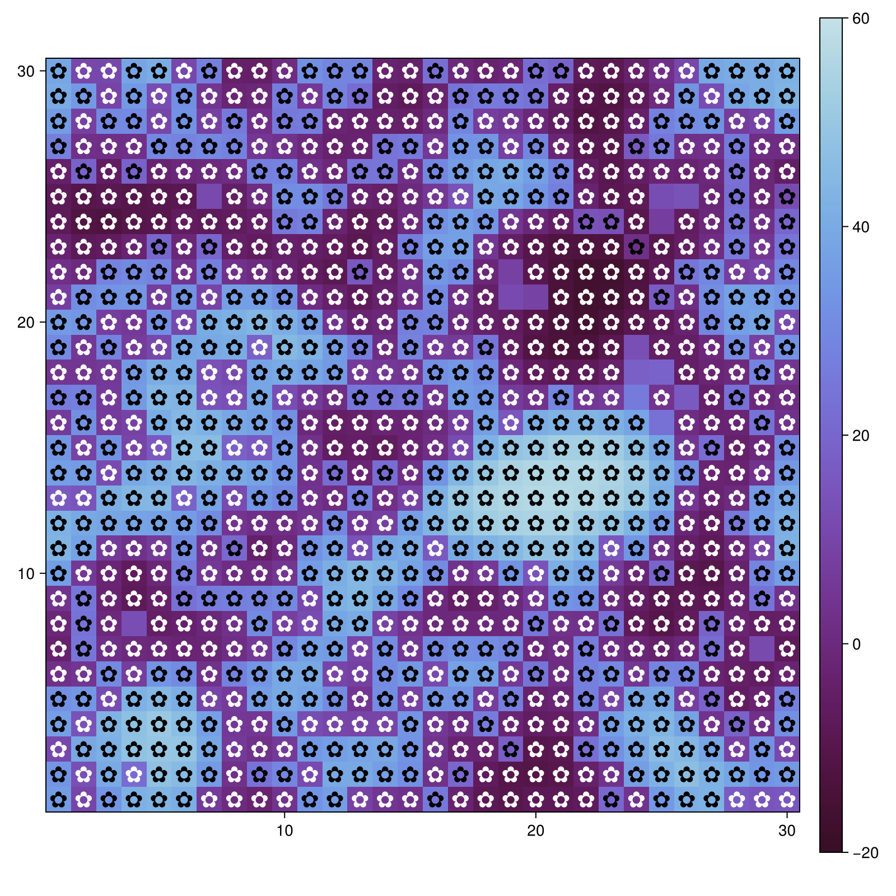
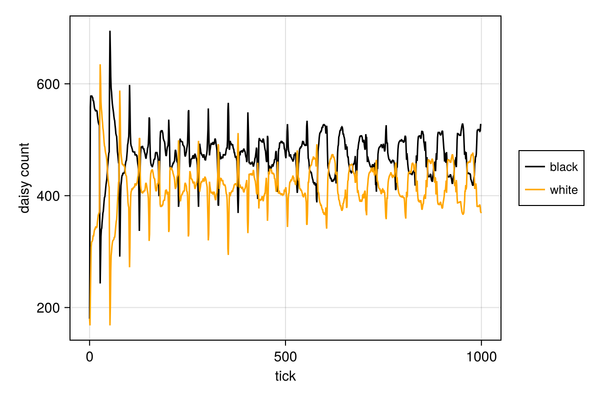
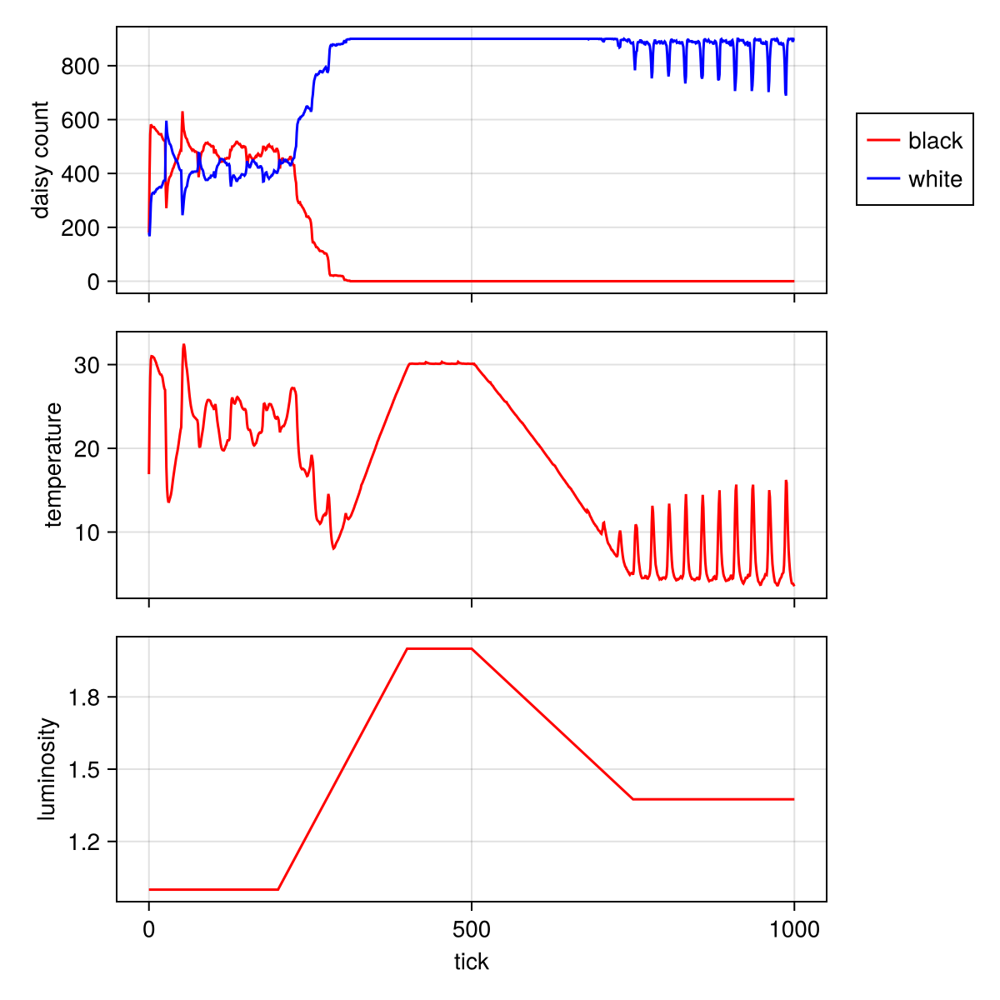
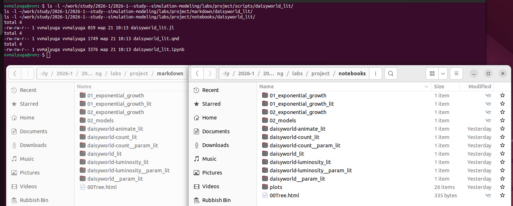

---
## Author
author:
  - name: "Малюга Валерия Васильевна"
    email: "1132236050@rudn.ru"
    affiliation: "Российский университет дружбы народов, Москва, РФ"
## Title
title: Презентация по лабораторной работе №3
subtitle: Агентное моделирование. Daisyworld
license: CC BY
date: today
date-format: "YYYY-MM-DD"
bibliography: bib/cite.bib
format:
  beamer:
    toc: true
    toc-title: Содержание
    number-sections: false
    number-depth: 1
    colorlinks: false
    toc-depth: 1
    aspectratio: 169
    section-titles: true
    incremental: false
    navigation: horizontal
    csquotes: true
    indent: true
    include-in-header:
      - file: _resources/tex/beamer.tex
    babel-lang: russian
    babel-otherlangs: english
    cite-method: biblatex
    biblio-style: gost-numeric
    biblatexoptions:
      - backend=biber
      - langhook=extras
      - autolang=other*
  revealjs:
    transition: slide
    margin: 0.2
    smaller: true
    slide-number: true
    output-ext: html
    theme: beige
    logo: _resources/image/logo_rudn.png
    fontsize: 0.9em
    self-contained: true
---

## Докладчик

* **Малюга Валерия Васильевна**
* Студент НФИбд-01-23
* Российский университет дружбы народов им. П. Лумумбы
* <https://vvmalyuga.github.io/ru/>
* [1132236050@rudn.ru](mailto:1132236050@rudn.ru)

## Цели и задачи

- Познакомиться с **агентным подходом** к имитационному моделированию
- Реализовать модель **Daisyworld** на языке Julia
- Провести **параметрическое исследование** модели
- Создать **литературные скрипты** и сгенерировать производные форматы (чистый код, Jupyter Notebook, Quarto)

## Задание

- Создать рабочий каталог, установить необходимые пакеты
- Выполнить предложенный код
- Преобразовать код в литературный стиль
- Сгенерировать производные форматы
- Интегрировать документацию в отчёт
- Добавить вычисления для набора параметров
- Выложить результаты на GitHub и GitVerse

## Теоретическое введение

### Агентное моделирование

Агентный подход (Agent-Based Modeling, ABM) — это метод исследования сложных систем, в котором поведение системы возникает из взаимодействия множества автономных сущностей (агентов). Вместо глобальных уравнений мы моделируем каждого агента и его правила, а затем наблюдаем коллективные паттерны [@datseris2022agents].

### DaisyWorld

Модель Daisyworld предложена Джеймсом Лавлоком и Эндрю Уотсоном для иллюстрации гипотезы Геи [@watson1983; @wood2008]. В этом мире на клеточной сетке растут чёрные и белые маргаритки, различающиеся альбедо (способностью отражать свет). Чёрные маргаритки поглощают больше тепла, нагревая среду; белые — отражают, охлаждая её. Размножение возможно только в определённом температурном диапазоне. За счёт обратной связи популяции маргариток стабилизируют планетарную температуру.

## Выполнение лабораторной работы

### Создание структуры каталогов

{width=40%}

## Выполнение лабораторной работы

### Установка пакетов

{width=60%}

## Выполнение лабораторной работы

### Базовая визуализация

{width=36%}

## Выполнение лабораторной работы

### Анимация

Скрипт `daisyworld-animate_lit.jl` создаёт видео эволюции модели.

{width=36%}

## Выполнение лабораторной работы

### Динамика численности

{width=60%}

## Выполнение лабораторной работы

### Динамика при изменении светимости

{width=42%}

## Выполнение лабораторной работы

### Параметрическое исследование

Варьировались `max_age` (25, 40) и `init_white` (0.2, 0.8).

{width=60%}

## Выполнение лабораторной работы

### Генерация производных форматов

С помощью `tangle.jl` созданы чистый код, Jupyter Notebook и документы Quarto.

{width=60%}
{width=60%}

## Результаты модели DaisyWorld

- **Базовая визуализация** подтверждает влияние альбедо на локальную температуру
- **Динамика численности** демонстрирует устойчивые колебания
- **Сценарий `:ramp`** показывает регуляторную способность маргариток
- **Параметрическое исследование** выявило влияние возраста и начальной доли на равновесие

## Выводы

В ходе лабораторной работы:

- Изучен **агентный подход** к имитационному моделированию
- Реализована модель **Daisyworld** на языке Julia
- Проведены вычислительные эксперименты:
  - базовая визуализация (три кадра: 0, 5, 40 шагов)
  - анимация эволюции модели
  - анализ динамики численности маргариток
  - исследование влияния изменения солнечной светимости
  - параметрическое исследование (варьирование `max_age` и `init_white`)
- Созданы **литературные версии кода**, из которых сгенерированы чистый код, Jupyter Notebook, документы Quarto
- Подготовлен отчёт и презентация в формате Quarto, все результаты выложены на GitHub и GitVerse

Модель демонстрирует **эмерджентную регуляцию температуры** – обратная связь через альбедо маргариток стабилизирует климат в широком диапазоне параметров.

## Список литературы

::: {#refs}
:::
