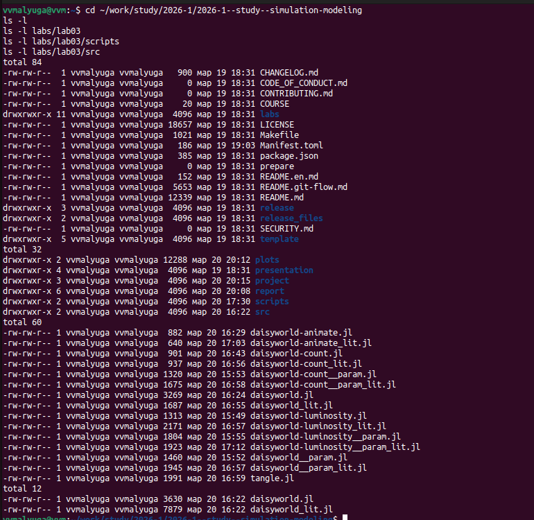
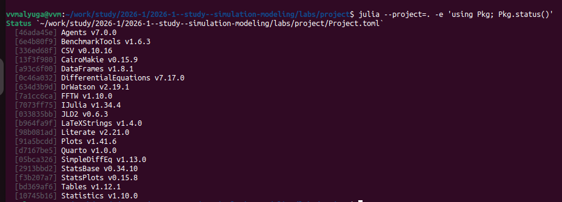
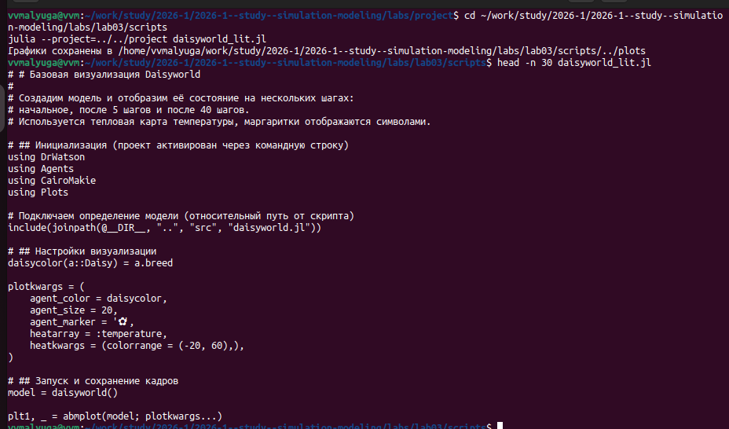
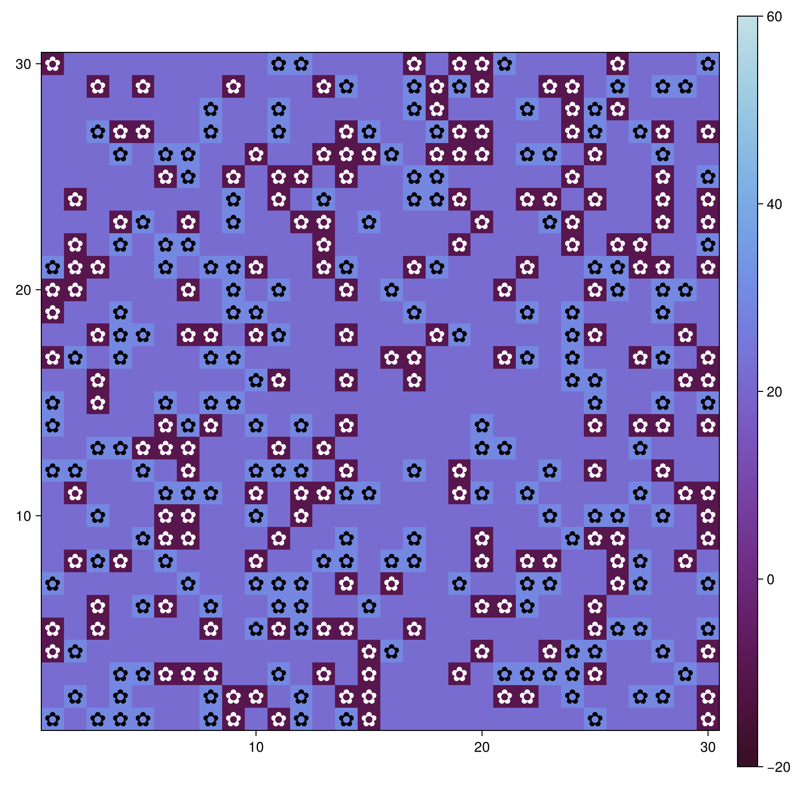
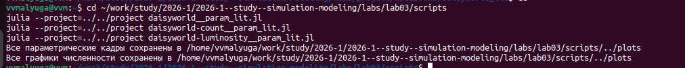
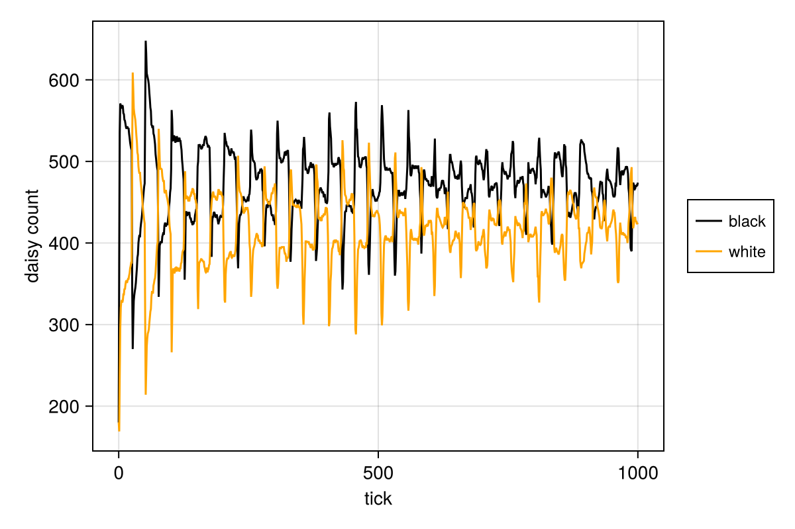

engine: julia

# Цель работы

Познакомиться с понятием агентного моделирования, создать необходимые файлы.

# Задание

- Создать рабочий каталог для кода.
- Установить необходимые пакеты.
- Выполнить предложенный код.
- Преобразовать код в литературный стиль.
- Сгенерировать из литературного кода:
  - чистый код;
  - jupyter notebook;
  - документацию в формате Quarto.
- Выполнить код из jupyter notebook.
- Интегрировать документацию в формате Quarto в отчёт.
- Добавить в код в литературном стиле вычисление для набора параметров.
- Сгенерировать из литературного кода с параметрами:
  - чистый код;
  - jupyter notebook;
  - документацию в формате Quarto.
- Выполнить код из jupyter notebook с параметрами.
- Интегрировать документацию с параметрами в формате Quarto в отчёт.
- Результирующие файлы выложить на git.

# Теоретическое введение

## Агентное моделирование

Агентный подход (Agent-Based Modeling, ABM) — это метод исследования сложных систем, в котором поведение системы возникает из взаимодействия множества автономных сущностей (агентов). Вместо глобальных уравнений мы моделируем каждого агента и его правила, а затем наблюдаем коллективные паттерны [@datseris2022agents].

### Основные компоненты агентной модели 

Любая агентная модель включает три основных элемента:

Агенты — это активные сущности. Они обладают:
Свойствами (атрибутами): возраст, цвет, запас ресурсов, координаты и т.п.
Правилами поведения: как агент реагирует на изменения среды и действия других агентов (например, перемещение, размножение, потребление).
Целями (не обязательно): в некоторых моделях агенты стремятся максимизировать свою выгоду или выжить.
Способностью к обучению или адаптации (в продвинутых моделях).
Среда — это пространство, в котором существуют агенты. Она может быть:
Дискретной (клеточная сетка, как в Daisyworld).
Непрерывной (двумерное или трёхмерное пространство).
Сетевой (граф социальных связей).
Абстрактной (например, рынок без явных координат).
Среда также может иметь свои свойства (температура, ресурсы) и динамику (диффузия, обновление).

Взаимодействия — правила, определяющие, как агенты влияют друг на друга и на среду. Они могут быть:
Локальными (только с соседями).
Глобальными (все агенты взаимодействуют со всеми).
Через среду (агенты изменяют среду, а среда влияет на агентов).

### Основные принципы 

Эмерджентность: глобальное поведение системы не закладывается явно, а возникает из локальных взаимодействий. Это позволяет открывать неожиданные закономерности.
Автономия: агенты действуют независимо, на основе своей внутренней логики.
Гетерогенность: агенты могут различаться по своим характеристикам и правилам, что отражает реальное разнообразие.
Локальность: чаще всего агенты обладают информацией только о своём ближайшем окружении.

## DaisyWorld

Модель Daisyworld предложена Джеймсом Лавлоком и Эндрю Уотсоном для иллюстрации гипотезы Геи [@watson1983; @wood2008]. В этом мире на клеточной сетке растут чёрные и белые маргаритки, различающиеся альбедо (способностью отражать свет). Чёрные маргаритки поглощают больше тепла, нагревая среду; белые — отражают, охлаждая её. Размножение возможно только в определённом температурном диапазоне. За счёт обратной связи популяции маргариток стабилизируют планетарную температуру.

### Описание модели

В модели Daisyworld агентами являются чёрные и белые маргаритки. Они живут на клеточной сетке (среда).

Свойства агентов: вид и возраст.

Правила:

Маргаритки изменяют локальную температуру за счёт разного альбедо.
Температура влияет на вероятность размножения (чем ближе к оптимуму, тем выше шанс заселить соседнюю пустую клетку).
Агенты стареют и умирают после определённого возраста.
Среда (температура) диффундирует между клетками.

### Агенты и параметры модели DaisyWorld 

Маргаритки двух типов — чёрные (black) и белые (white). Каждая маргаритка занимает одну клетку сетки и имеет возраст (количество шагов с момента появления).
Двумерная квадратная сетка (например, 30×30) с периодическими границами.

luminosity – солнечная постоянная (может изменяться со временем).
albedo_black, albedo_white – альбедо чёрных и белых маргариток.
surface_albedo — альбедо пустой почвы.
max_age — максимальный возраст маргаритки.

### Динамика 

Для каждой клетки рассчитывается локальная температура.

Каждая маргаритка может погибнуть с вероятностью, зависящей от температуры. Если температура выходит за допустимый диапазон, вероятность смерти повышается.

Если клетка пуста, на неё может попасть семя от соседней маргаритки. Вероятность успешного прорастания зависит от температуры клетки. Если вероятность превышает случайное число, на пустой клетке появляется новая маргаритка того же цвета, что и родительская.

# Выполнение лабораторной работы

## Создание структуры каталогов и установка пакетов

Был создан рабочий каталог  и общий проект `labs/project` ([рис. @fig-001]). В проект установлены необходимые пакеты: `Agents`, `CairoMakie` и др. (рис. @fig-002).

{#fig-001 width=70%}

{#fig-002 width=70%}

## Реализация модели

Файл `src/daisyworld.jl` содержит определение агента `Daisy` и основные функции: обновление температуры, диффузию, размножение, старение и изменение солнечной активности. Литературная версия этого файла была оформлена с подробными комментариями.

## Базовая визуализация

Скрипт `scripts/daisyworld_lit.jl` создаёт модель и сохраняет три кадра: начальное состояние, после 5 шагов и после 40 шагов (рис. @fig-basic). На тепловой карте отображается температура, а маргаритки показаны символами (чёрные и белые).

{#fig-basic width=70%}

## Анимация

Скрипт `scripts/daisyworld-animate_lit.jl` создаёт видео `simulation.mp4`, демонстрирующее эволюцию модели(рис. @fig-animate).

{#fig-animate width=70%}

## Динамика численности

Скрипт `scripts/daisyworld-count_lit.jl` строит график изменения количества чёрных и белых маргариток за 1000 шагов (рис. @fig-count). Видны колебания, отражающие регуляцию численности.

{#fig-count width=70%}

## Динамика модели при изменении светимости

Скрипт `scripts/daisyworld-luminosity_lit.jl` использует сценарий `:ramp` (светимость сначала увеличивается, затем уменьшается). На комплексном графике показаны численность маргариток, средняя температура и светимость (рис. @fig-luminosity).

{#fig-luminosity width=70%}

## Параметрическое исследование

Для исследования влияния параметров были созданы три скрипта с параметрическими запусками (рис. @fig-param):

- `daisyworld__param_lit.jl` – базовая визуализация для комбинаций `max_age` и `init_white`.
- `daisyworld-count__param_lit.jl` – графики численности.
- `daisyworld-luminosity__param_lit.jl` – комплексные графики для сценария `:ramp`.

{#fig-param width=70%}

Пример результатов параметрического исследования показан на рис. @fig-param-count.

{#fig-param-count width=70%}

## Генерация производных форматов

С помощью скрипта `scripts/tangle.jl` для каждого литературного скрипта были созданы чистый код, Jupyter Notebook и документ Quarto (рис. @fig-tangle). Эти файлы сохранены в `labs/project/scripts`, `labs/project/markdown`, `labs/project/notebooks`.

{#fig-tangle width=70%}

{#fig-generated width=70%}

## Интеграция в отчёт

Все сгенерированные Quarto-документы были включены в отчёт с помощью конструкции `` (см. раздел **Реализация**).

# Реализация

## Базовая модель



## Анимация



## Динамика численности



## Динамика при изменении светимости



## Параметрическое исследование (базовая визуализация)



## Параметрическое исследование (динамика численности)



## Параметрическое исследование (динамика при изменении светимости)



# Анализ результатов

- **Базовая визуализация** показывает, что чёрные маргаритки (более тёмные области на тепловой карте) локально нагревают среду, а белые – охлаждают. Через 40 шагов система приходит к равновесию.
- **Динамика численности** демонстрирует устойчивые колебания: при увеличении светимости возрастает доля белых маргариток, при уменьшении – чёрных.
- **Сценарий :ramp** подтверждает регуляторную способность маргариток: в ответ на рост светимости увеличивается количество белых маргариток, что стабилизирует температуру.
- **Параметрическое исследование** показало, что увеличение `max_age` замедляет смену поколений, а увеличение начальной доли белых маргариток смещает равновесие в сторону более низкой температуры.

# Выводы

В ходе выполнения лабораторной работы:

Изучен агентный подход к имитационному моделированию.

Реализована модель Daisyworld на Julia с использованием пакета Agents.jl.

Проведены вычислительные эксперименты, включая параметрическое исследование.

Созданы литературные версии кода и сгенерированы чистый код, Jupyter Notebook и документы Quarto.

Подготовлен отчёт и презентация в формате Quarto.

Все результаты сохранены в репозитории GitHub.

# Список литературы{.unnumbered}

::: {#refs}
:::
