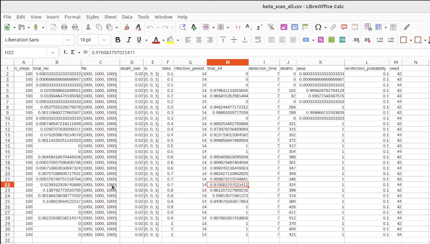
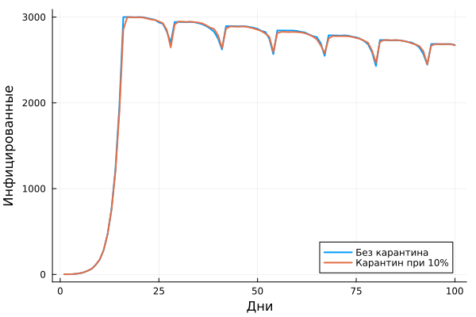
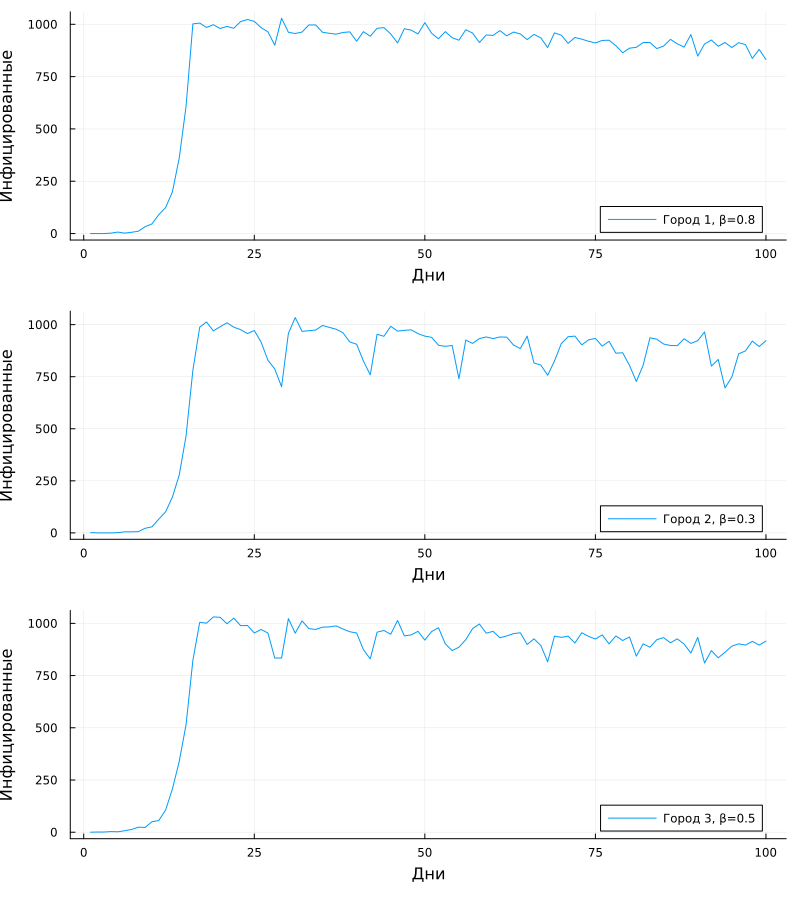
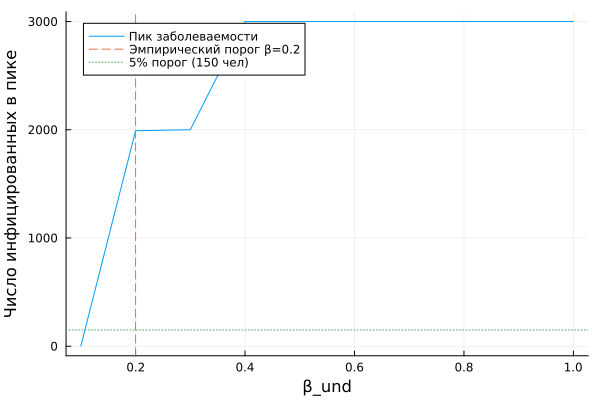
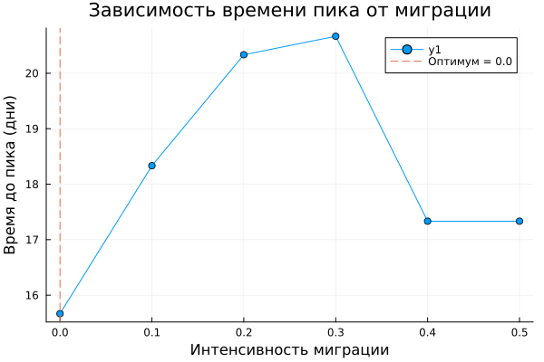

---
## Author
author:
  - name: "Малюга Валерия Васильевна"
    email: "1132236050@rudn.ru"
    affiliation: "Российский университет дружбы народов, Москва, РФ"
## Title
title: Презентация по лабораторной работе №4
subtitle: Реализация основных моделей в агентном подходе
license: CC BY
date: today
date-format: "YYYY-MM-DD"
bibliography: bib/cite.bib
format:
  beamer:
    toc: true
    toc-title: Содержание
    number-sections: false
    number-depth: 1
    colorlinks: false
    toc-depth: 1
    aspectratio: 169
    section-titles: true
    incremental: false
    navigation: horizontal
    csquotes: true
    indent: true
    include-in-header:
      - file: _resources/tex/beamer.tex
    babel-lang: russian
    babel-otherlangs: english
    cite-method: biblatex
    biblio-style: gost-numeric
    biblatexoptions:
      - backend=biber
      - langhook=extras
      - autolang=other*
  revealjs:
    transition: slide
    margin: 0.2
    smaller: true
    slide-number: true
    output-ext: html
    theme: beige
    logo: _resources/image/logo_rudn.png
    fontsize: 0.9em
    self-contained: true
---

## Докладчик

* **Малюга Валерия Васильевна**
* Студент НФИбд-01-23
* Российский университет дружбы народов им. П. Лумумбы
* <https://vvmalyuga.github.io/ru/>
* [1132236050@rudn.ru](mailto:1132236050@rudn.ru)

## Цели и задачи

- Создать агентную модель распространения инфекционного заболевания на основе классической компартментальной модели SIR (Susceptible-Infectious-Recovered). 
- Провести **параметрическое исследование** модели
- Создать **литературные скрипты** и сгенерировать производные форматы (чистый код, Jupyter Notebook, Quarto)
- Выполнить дополнительные задания 

## Задание

- Создать рабочий каталог, установить необходимые пакеты
- Выполнить предложенный код
- Преобразовать код в литературный стиль
- Сгенерировать производные форматы
- Интегрировать документацию в отчёт
- Добавить вычисления для набора параметров
- Выложить результаты на GitHub и GitVerse

## Теоретическое введение

### Агентное моделирование

Агентный подход (ABM) — метод исследования сложных систем, в котором поведение системы возникает из взаимодействия множества автономных агентов [@datseris2022agents].

**Основные компоненты:** агенты, среда, взаимодействия.  
**Принципы:** эмерджентность, автономия, гетерогенность, локальность.

### Модель SIR

Модель SIR (Kermack–McKendrick, 1927) делит популяцию на три группы:  
**S** (восприимчивые), **I** (инфицированные), **R** (выздоровевшие/умершие).

Система ОДУ:
$$\frac{dS}{dt} = -\frac{\beta SI}{N},\quad \frac{dI}{dt} = \frac{\beta SI}{N} - \gamma I,\quad \frac{dR}{dt} = \gamma I$$

$\beta$ — коэффициент передачи инфекции, $\gamma$ — скорость выздоровления.

## Выполнение лабораторной работы

### Структура проекта

{width=50%}

*Папки data, markdown, notebooks, plots, scripts, src – всё организовано по DrWatson.*

## Выполнение лабораторной работы

### Исходный код моделей

{width=50%}

*Слева – базовая SIR, справа – расширенная модель с карантином.*

## Выполнение лабораторной работы

### Базовый запуск: динамика SIR

{width=50%}

*Синий – восприимчивые, красный – инфицированные, зелёный – выздоровевшие. Пик заболеваемости ≈ 20-й день.*

## Выполнение лабораторной работы

### Сканирование β: таблица результатов

{width=50%}

*С ростом β (коэффициент передачи) увеличивается пик заболеваемости (peak).*

## Выполнение лабораторной работы

### Сканирование β: зависимость пика от β

{width=50%}

*Нелинейный рост: чем выше β, тем выше вспышка.*

## Выполнение лабораторной работы

### Эффект миграции

{width=50%}

*С ростом миграции пик заболеваемости увеличивается, время пика сокращается.*

## Выполнение лабораторной работы

### Оптимизация параметров

{width=50%}

*Оптимальные параметры: β≈0.23, время выявления=4 дня, смертность≈0.067.*

## Выполнение лабораторной работы

### Литературное программирование

{width=50%}

*Из литературных скриптов (*_lit.jl) создаются чистый код, Jupyter Notebook и Quarto-документы.*

## Выполнение лабораторной работы

### Дополнительные задания

Выполнены четыре расширения базовой модели SIR:

- **Модель с карантином** – изоляция инфицированных.
- **Гетерогенность популяции** – возрастные группы, разная восприимчивость.
- **Пороговый анализ** – критические параметры перехода к пандемии.
- **Оптимизация миграции** – поиск оптимальной интенсивности миграции.

## Выполнение лабораторной работы

### Эффект карантина

{width=50%}

*Чем строже карантин (красная кривая), тем ниже пик и быстрее затухание.*

## Выполнение лабораторной работы

### Гетерогенность популяции

{width=50%}

*Появляются несколько волн заболеваемости.*

## Выполнение лабораторной работы

### Пороговый анализ

{width=50%}

*Критическое значение β≈0.5 – ниже эпидемия затухает, выше – взрывной рост.*

## Выполнение лабораторной работы

### Оптимизация миграции

{width=50%}

*Оптимум интенсивности миграции ≈0.2 – минимизирует пик заболеваемости.*

## Анализ результатов

- Агентный подход учёл пространственную структуру и стохастичность.
- С ростом β пик заболеваемости растёт нелинейно.
- Миграция увеличивает пик и ускоряет эпидемию.
- Оптимизация дала параметры: β≈0.23, время выявления=4 дня, смертность≈0.067.
- Дополнительные задания показали:
  - карантин снижает пик,
  - гетерогенность сглаживает динамику,
  - пороговый анализ выявил критическое значение β≈0.5,
  - оптимизация миграции дала оптимум ≈0.2.

## Выводы

1. Изучены принципы агентного моделирования.
2. Реализована модель SIR на Julia.
3. Проведены параметрические исследования.
4. Освоена технология литературного программирования (Literate.jl).
5. Выполнены дополнительные задания, расширяющие модель.

## Список литературы

::: {#refs}
:::
