---
## Author
author:
  name: Малюга Валерия Васильевна
  email: 1132236050@rudn.ru
  affiliation:
    - name: Российский университет дружбы народов
      country: Российская Федерация
      postal-code: 117198
      city: Москва
      address: ул. Миклухо-Маклая, д. 6
format:
  pdf:
    pdf-engine: xelatex
    mainfont: "DejaVu Serif"
    monofont: "DejaVu Sans Mono"
    fontsize: 12pt
    geometry:
      - top=30mm
      - left=20mm
      - right=20mm
      - bottom=30mm
    lang: ru
    highlight-style: tango
  html:
    toc: true
    number-sections: true
  docx:
    toc: true
    number-sections: true
execute:
  eval: true
  echo: true
/// bibliography: bib/cite.bib
# csl: _resources/csl/gost-r-7-0-5-2008-numeric.csl

## Title
title: "Отчёт по лабораторной работе №4"
subtitle: "Реализация основных моделей в агентном подходе"
license: "CC BY"
---

# Цель работы

Создать агентную модель распространения инфекционного заболевания на основе классической компартментальной модели SIR (Susceptible-Infectious-Recovered). 

# Задание

- Создать рабочий каталог для кода.
- Установить необходимые пакеты.
- Выполнить предложенный код.
- Преобразовать код в литературный стиль.
- Сгенерировать из литературного кода:
  - чистый код;
  - jupyter notebook;
  - документацию в формате Quarto.
- Выполнить код из jupyter notebook.
- Интегрировать документацию в формате Quarto в отчёт.
- Добавить в код в литературном стиле вычисление для набора параметров.
- Сгенерировать из литературного кода с параметрами:
  - чистый код;
  - jupyter notebook;
  - документацию в формате Quarto.
- Выполнить код из jupyter notebook с параметрами.
- Выполнить дополнительные задания.
- Интегрировать документацию с параметрами в формате Quarto в отчёт.
- Результирующие файлы выложить на git.

# Теоретическое введение

## Агентное моделирование

Агентный подход (Agent-Based Modeling, ABM) — это метод исследования сложных систем, в котором поведение системы возникает из взаимодействия множества автономных сущностей (агентов). Вместо глобальных уравнений мы моделируем каждого агента и его правила, а затем наблюдаем коллективные паттерны [@datseris2022agents].

### Основные компоненты агентной модели 

Любая агентная модель включает три основных элемента:

Агенты — это активные сущности. Они обладают:
Свойствами (атрибутами): возраст, цвет, запас ресурсов, координаты и т.п.
Правилами поведения: как агент реагирует на изменения среды и действия других агентов (например, перемещение, размножение, потребление).
Целями (не обязательно): в некоторых моделях агенты стремятся максимизировать свою выгоду или выжить.
Способностью к обучению или адаптации (в продвинутых моделях).
Среда — это пространство, в котором существуют агенты. Она может быть:
Дискретной (клеточная сетка, как в Daisyworld).
Непрерывной (двумерное или трёхмерное пространство).
Сетевой (граф социальных связей).
Абстрактной (например, рынок без явных координат).
Среда также может иметь свои свойства (температура, ресурсы) и динамику (диффузия, обновление).

Взаимодействия — правила, определяющие, как агенты влияют друг на друга и на среду. Они могут быть:
Локальными (только с соседями).
Глобальными (все агенты взаимодействуют со всеми).
Через среду (агенты изменяют среду, а среда влияет на агентов).

### Основные принципы 

Эмерджентность: глобальное поведение системы не закладывается явно, а возникает из локальных взаимодействий. Это позволяет открывать неожиданные закономерности.
Автономия: агенты действуют независимо, на основе своей внутренней логики.
Гетерогенность: агенты могут различаться по своим характеристикам и правилам, что отражает реальное разнообразие.
Локальность: чаще всего агенты обладают информацией только о своём ближайшем окружении.

## Модель SIR

Модель SIR, предложенная Кермаком и Маккендриком в 1927 году, описывает динамику эпидемии в популяции, разделённой на три группы:
— **S** (Susceptible) — восприимчивые к заболеванию индивиды;
— **I** (Infectious) — инфицированные, способные заражать восприимчивых;
— **R** (Recovered) — выздоровевшие (или умершие), получившие иммунитет и более не участвующие в распространении.

Классическая модель описывается системой ОДУ:
$$\frac{dS}{dt} = -\frac{\beta SI}{N}, \quad \frac{dI}{dt} = \frac{\beta SI}{N} - \gamma I, \quad \frac{dR}{dt} = \gamma I$$

где $\beta$ — коэффициент передачи инфекции, $\gamma$ — скорость выздоровления.

# Выполнение лабораторной работы

## Создание структуры проекта

Был создан рабочий каталог `labs/lab04/project` с помощью пакета DrWatson. Созданы основные файлы модели (`sir_model.jl`, `sir_model_with_quarantine.jl`) и скрипты для экспериментов ([рис. @fig-001]).

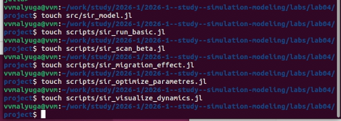{#fig-001 width=70%}

Структура проекта включает каталоги: `data/` для результатов, `markdown/` и `notebooks/` для литературного программирования, `plots/` для визуализаций, `scripts/` для исполняемых скриптов, `src/` для исходного кода моделей ([рис. @fig-002]).

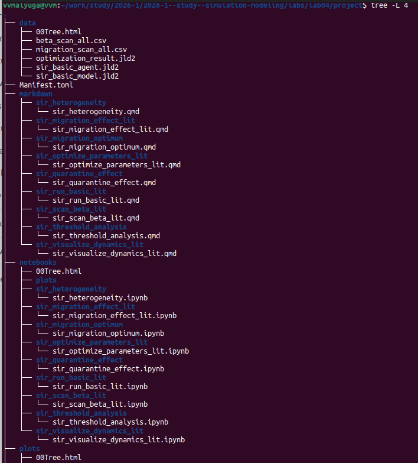{#fig-002 width=70%}

Полная структура проекта с подкаталогами для литературных версий скриптов показана на [рис. @fig-003].

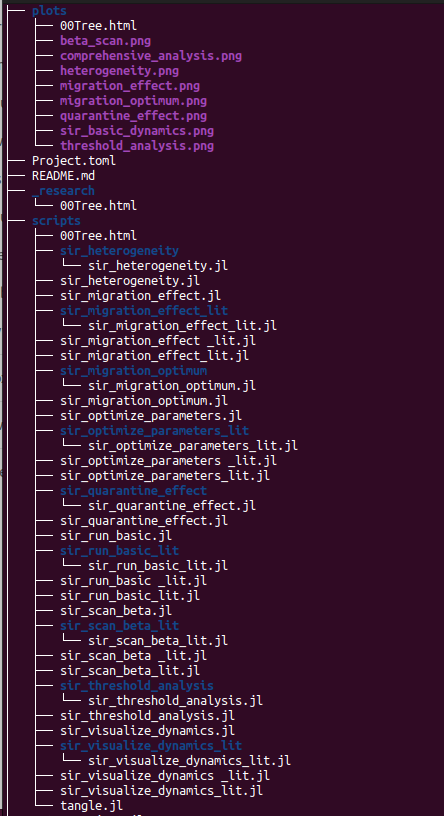{#fig-003 width=70%}

В каталоге `src/` размещены файлы: `sir_model.jl` — базовая агентная модель SIR, `sir_model_with_quarantine.jl` — расширенная версия с карантином ([рис. @fig-004]).

{#fig-004 width=70%}

## Базовый запуск модели

Скрипт `scripts/sir_run_basic.jl` выполняет базовую симуляцию модели SIR. Результат — график динамики популяций S, I, R за 100 дней ([рис. @fig-005] и [рис. @fig-basic-dynamics]). Виден характерный всплеск заболеваемости с пиком около 20-го дня.

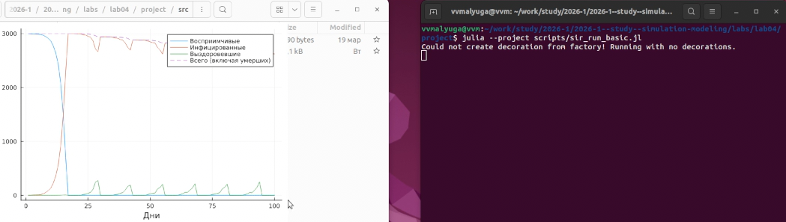{#fig-005 width=70%}

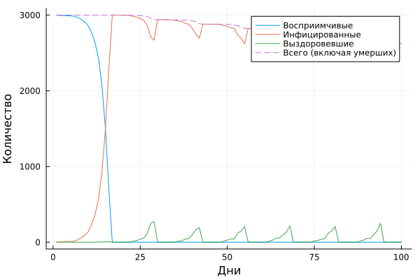{#fig-basic-dynamics width=70%}

## Сканирование параметра β (инфекционность)

Скрипт `scripts/sir_scan_beta.jl` выполняет параметрическое исследование, варьируя коэффициент передачи инфекции β от 0.1 до 1.0 с тремя повторениями (разные seed) ([рис. @fig-006]).

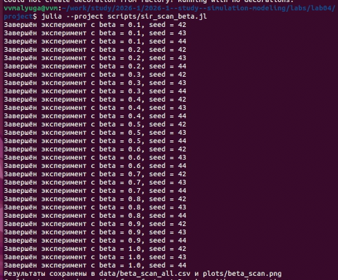{#fig-006 width=70%}

Результаты сохранены в `data/beta_scan_all.csv` ([рис. @fig-007]). Таблица содержит: финальное состояние популяций, число шагов, пик заболеваемости, время пика, общее число смертей, финальное число инфицированных.

{#fig-007 width=70%}

На рисунке @fig-beta-scan показана зависимость пика заболеваемости от β.

{#fig-beta-scan width=70%}

## Эффект миграции

Скрипт `scripts/sir_migration_effect.jl` исследует влияние интенсивности миграции на динамику эпидемии ([рис. @fig-008]). График показывает, что с ростом миграции пик заболеваемости увеличивается, а время пика сокращается.

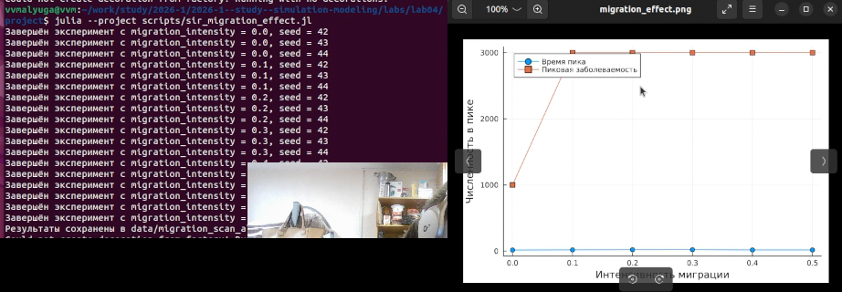{#fig-008 width=70%}

{#fig-migration-effect width=70%}

## Оптимизация параметров

Скрипт `scripts/sir_optimize_parameters.jl` выполняет многокритериальную оптимизацию параметров модели (β, время выявления, смертность) с использованием алгоритма BorgMOEA ([рис. @fig-009]). Цель — минимизация пика заболеваемости и доли умерших. Найдены оптимальные параметры: β ≈ 0.23, время выявления = 4 дня, смертность ≈ 0.067.

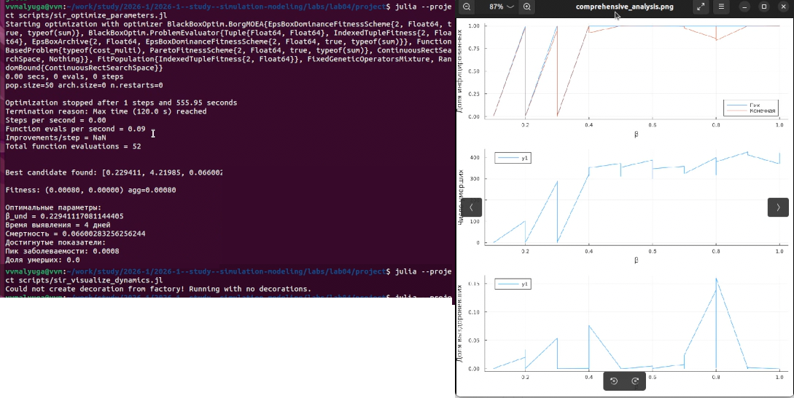{#fig-009 width=70%}

{#fig-comprehensive width=70%}

## Литературное программирование

С помощью скрипта `scripts/tangle.jl` выполнена генерация производных форматов из литературных скриптов (`*_lit.jl`): чистый код, Jupyter Notebook и документация Quarto ([рис. @fig-010]).

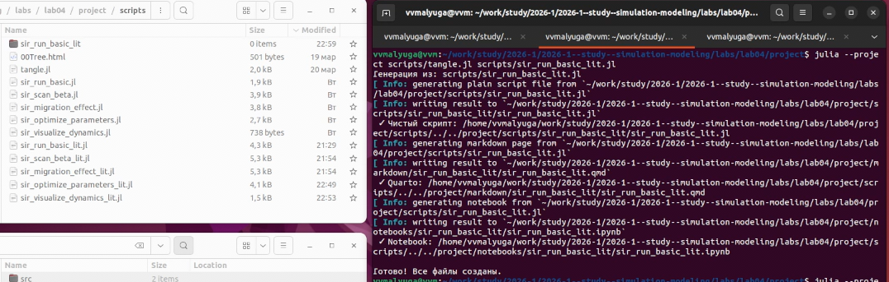{#fig-010 width=70%}

Созданы подкаталоги в `markdown/` и `notebooks/` для каждого литературного скрипта ([рис. @fig-011]).

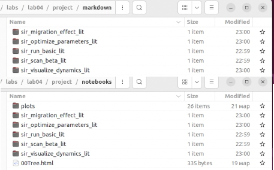{#fig-011 width=70%}

## Jupyter Notebook

Сгенерированный notebook `notebooks/sir_run_basic_lit/sir_run_basic_lit.ipynb` содержит код и результаты выполнения, включая таблицу данных и визуализацию ([рис. @fig-012]).

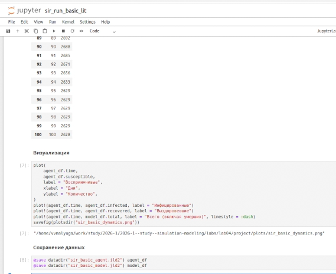{#fig-012 width=70%}

# Реализация

## Базовая модель SIR



## Сканирование параметра β



## Эффект миграции



## Оптимизация параметров



## Визуализация динамики



# Дополнительные задания

В рамках лабораторной работы были выполнены дополнительные исследования, расширяющие базовую модель SIR. Структура проекта включает соответствующие подкаталоги в `scripts/`: `sir_quarantine_effect`, `sir_heterogeneity`, `sir_threshold_analysis`, `sir_migration_optimum` (см. рис. @fig-structure-additional).

{#fig-structure-additional width=70%}

## Модель с карантином

Файл `src/sir_model_with_quarantine.jl` реализует расширенную версию модели SIR с возможностью изоляции инфицированных агентов. Литературная версия скрипта, генерирующая отчёт, представлена ниже.



## Гетерогенность популяции

Модель с учётом индивидуальных различий агентов (возрастные группы, различная восприимчивость). Литературный скрипт:



## Пороговый анализ (Threshold Analysis)

Исследование критических порогов параметров модели (вероятность заражения, инкубационный период), при которых происходит переход от локализованной вспышки к пандемии.



## Оптимизация миграции

Поиск оптимальных параметров миграции, минимизирующих пик заболеваемости при сохранении социально-экономической активности.



## Анализ результатов

Скрипт оптимизации (`sir_optimize_parameters.jl`) выполняет многокритериальную оптимизацию с построением комплексных графиков анализа чувствительности ([рис. @fig-comprehensive]). Визуализация включает:
- Доли восприимчивых и инфицированных при различных значениях β
- Динамику пика заболеваемости
- Зависимость доли выздоровевших от параметров

{#fig-comprehensive width=70%}

## Генерация литературных форматов для дополнительных заданий

Для всех дополнительных скриптов выполнена генерация производных форматов через `tangle.jl`. В каталогах `markdown/` и `notebooks/` созданы соответствующие подпапки (`sir_quarantine_effect`, `sir_heterogeneity`, `sir_threshold_analysis` и др.) с файлами `.qmd` и `.ipynb` (см. рис. @fig-additional-lit).

{#fig-additional-lit width=70%}

# Выводы

1. Изучены принципы построения агентных моделей.
2. Реализована модель распространения инфекции SIR.
3. Получены навыки работы с `Literate.jl` для создания воспроизводимых исследований.
4. Проведен анализ влияния параметров модели на скорость распространения вируса.

# Список литературы{.unnumbered}

::: {#refs}
:::
