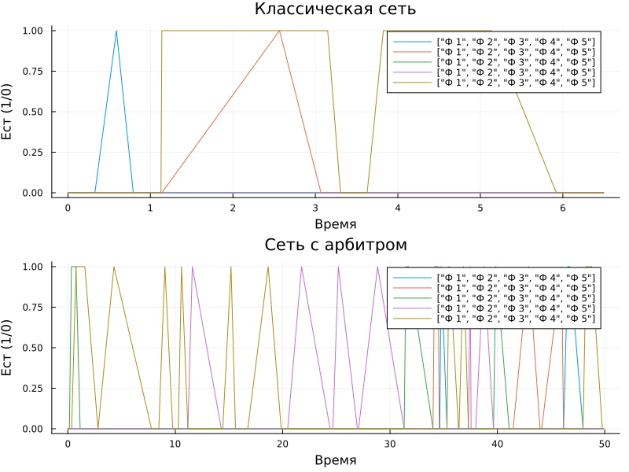
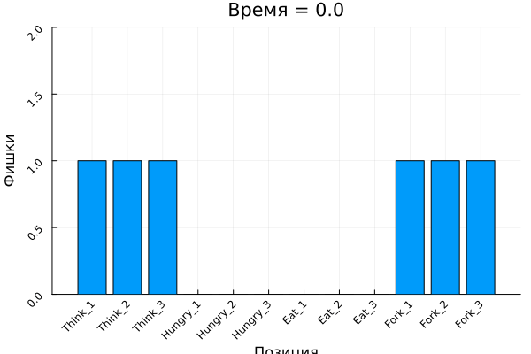
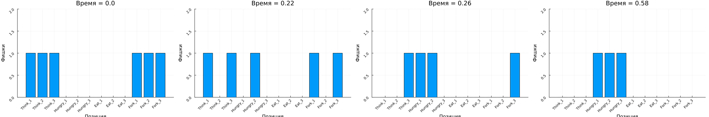
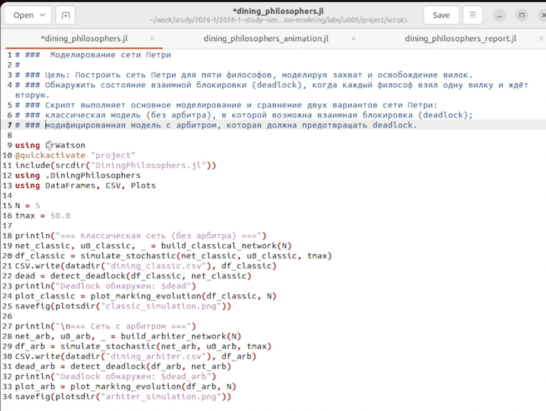
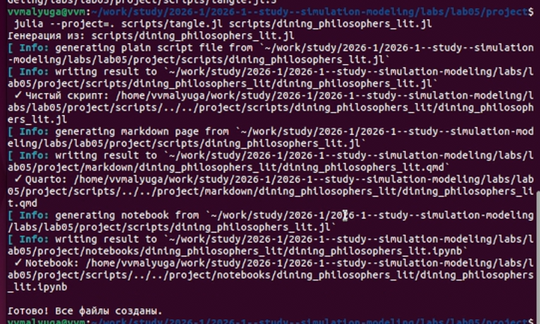

---
## Author
author:
  - name: "Малюга Валерия Васильевна"
    email: "1132236050@rudn.ru"
    affiliation: "Российский университет дружбы народов, Москва, РФ"
## Title
title: "Презентация по лабораторной работе №5"
subtitle: "Аппарат сетей Петри. Задача «Обедающие философы»"
license: "CC BY"
date: today
date-format: "YYYY-MM-DD"
bibliography: bib/cite.bib
csl: _resources/csl/gost-r-7-0-5-2008-numeric.csl
format:
  beamer:
    toc: true
    toc-title: "Содержание"
    number-sections: false
    number-depth: 1
    colorlinks: false
    toc-depth: 1
    aspectratio: 169
    section-titles: true
    incremental: false
    navigation: horizontal
    csquotes: true
    indent: true
    include-in-header:
      - file: _resources/tex/beamer.tex
    pdf-engine: xelatex                   
    mainfont: "DejaVu Serif"              
    monofont: "DejaVu Sans Mono"          
    babel-lang: russian
    babel-otherlangs: english
    cite-method: biblatex
    biblio-style: gost-numeric
    biblatexoptions:
      - backend=biber
      - langhook=extras
      - autolang=other*
    fig-format: png
    fig-dpi: 300
    fontsize: 9pt 
  revealjs:
    transition: slide
    margin: 0.2
    smaller: true
    slide-number: true
    output-ext: html
    theme: beige
    logo: _resources/image/logo_rudn.png
    fontsize: 1.1em  
    self-contained: true
    fig-format: png
    css: styles.css
execute:
  eval: false
  echo: false
---

## Докладчик

* **Малюга Валерия Васильевна**
* Студент НФИбд-01-23
* Российский университет дружбы народов им. П. Лумумбы
* <https://vvmalyuga.github.io/ru/>
* [1132236050@rudn.ru](mailto:1132236050@rudn.ru)

# Цели и задачи

1. Построить сеть Петри для пяти философов, моделируя захват и освобождение вилок.
2. Обнаружить состояние взаимной блокировки (deadlock), когда каждый философ взял одну вилку и ждёт вторую.
3. Провести имитационное моделирование (стохастическое и детерминированное) и выявить наличие deadlock.
4. Модифицировать сеть, чтобы предотвратить deadlock.
5. Проанализировать результаты и оформить отчёт с графиками и анимацией.

# Задание

- Создать рабочий каталог, установить необходимые пакеты
- Выполнить предложенный код
- Преобразовать код в литературный стиль
- Сгенерировать производные форматы
- Интегрировать документацию в отчёт
- Добавить вычисления для набора параметров
- Выложить результаты на GitHub и GitVerse

# Теоретическое введение

## Сеть Петри

Сеть Петри была предложена Карлом Адамом Петри в 1962 году [@petri1962kommunikation]. Это математический аппарат для моделирования дискретных систем. Графически она представляется как двудольный ориентированный граф двух типов вершин: позиции (круги) и переходы (прямоугольники).

- Позиции (Places) суть пассивные элементы, описывающие состояние системы (например, наличие ресурса или выполнение условия). Внутри позиции могут находиться фишки (tokens) — неотрицательное целое число, указывающее на количество ресурсов.
- Переходы (Transitions) суть активные элементы, описывающие события или действия системы. Они могут срабатывать, изменяя состояние модели.
- Дуги (Arcs) суть направленные соединения между позициями и переходами (но не между двумя позициями или двумя переходами), которые показывают, как состояние влияет на события и наоборот.
- Маркировка (Marking) есть распределение фишек по позициям в определённый момент времени, то есть текущее состояние модели. Смена маркировок происходит при срабатывании переходов в соответствии с определёнными правилами.

## Обедающие философы

\small
### Классическая постановка
За круглым столом сидят N философов. Перед каждым философом стоит тарелка с едой. Между каждыми двумя соседними философами лежит одна вилка (или палочка для еды). Таким образом, количество вилок равно количеству философов. Задача была сформулирована Эдсгером Дейкстрой в 1965 году как иллюстрация проблемы синхронизации в параллельных вычислительных системах [@dijkstra1971hierarchical].

### Основные положения 

1. Правила поведения философов:
- Философ может находиться в одном из трёх состояний: думает, голоден (хочет есть), ест.
- Чтобы поесть, философу необходимы две вилки — та, что слева от него, и та, что справа.
- Если философ не может получить обе вилки одновременно, он ждёт, пока они освободятся.
- Поев, философ кладёт обе вилки обратно на стол и возвращается к размышлениям.

	2. Ограничения:
- Вилками нельзя пользоваться одновременно двум философам.
- Философ не может отнять вилку у соседа — только дождаться, пока тот её положит.
\normalsize

## Выполнение лабораторной работы

### Структура проекта и модуль

{width=60%}

*Каталоги `src/`, `scripts/`, `data/`, `plots/` организованы по DrWatson.*

## Классическая сеть (без арбитра)

{width=26%}

*Четыре панели: Think, Hungry, Eat, Fork. Со временем все философы голодны — deadlock.*

## Сеть с арбитром

{width=26%}

*Введение позиции Arbiter с N-1 фишками предотвращает блокировку.*

## Сравнительный анализ состояния «Ест»
\small
{width=40%}

*В классической сети все линии падают до нуля; с арбитром — постоянная активность.*
\normalsize

## Анимация работы сети Петри

::: {.content-hidden when-format="beamer"}
{width=80%}
:::

::: {.content-hidden when-format="revealjs"}
{width=100%}
:::

*Наглядно показывает перемещение фишек и момент застывания системы.*

## Литературное программирование

\small

{width=50%}

## Литературное программирование

{width=50%}

*Из литературных скриптов созданы чистый код, Jupyter Notebook и Quarto-документы.*

\normalsize

## Проверка в Jupyter Notebook

{width=40%}

# Анализ результатов

- **Классическая сеть:** deadlock неизбежен, через ~10–20 шагов все философы голодны.
- **Сеть с арбитром:** блокировка отсутствует, философы поочерёдно едят.
- **Анимация** визуализирует процесс «застывания» в классической модели.
- **Сравнительный график** количественно подтверждает эффективность арбитра.

# Выводы

1. Построены и исследованы две сети Петри для задачи «Обедающие философы».
2. Реализовано стохастическое моделирование (алгоритм Гиллеспи).
3. Подтверждено возникновение deadlock в классической модели и его предотвращение с помощью арбитра.
4. Код оформлен в стиле литературного программирования, сгенерированы все производные форматы.
5. Отчёт и презентация подготовлены в Quarto, все результаты воспроизводимы.

# Список литературы

::: {#refs}
:::
