# Цель работы

1. Построить сеть Петри для пяти философов, моделируя захват и освобождение вилок.
2. Обнаружить состояние взаимной блокировки (deadlock), когда каждый философ взял одну вилку и ждёт вторую.
3. Провести имитационное моделирование (стохастическое и детерминированное) и выявить наличие deadlock.
4. Модифицировать сеть, чтобы предотвратить deadlock.
5. Проанализировать результаты и оформить отчёт с графиками и анимацией.

# Задание

- Создать рабочий каталог для кода.
- Установить необходимые пакеты.
- Выполнить предложенный код.
- Преобразовать код в литературный стиль.
- Сгенерировать из литературного кода:
  - чистый код;
  - jupyter notebook;
  - документацию в формате Quarto.
- Выполнить код из jupyter notebook.
- Интегрировать документацию в формате Quarto в отчёт.
- Добавить в код в литературном стиле вычисление для набора параметров.
- Сгенерировать из литературного кода с параметрами:
  - чистый код;
  - jupyter notebook;
  - документацию в формате Quarto.
- Выполнить код из jupyter notebook с параметрами.
- Выполнить дополнительные задания.
- Интегрировать документацию с параметрами в формате Quarto в отчёт.
- Результирующие файлы выложить на git.

# Теоретическое введение

## Общая информация
Сеть Петри была предложена Карлом Адамом Петри в 1962 году [@petri1962kommunikation]. Это математический аппарат для моделирования дискретных систем. Графически она представляется как двудольный ориентированный граф двух типов вершин: позиции (круги) и переходы (прямоугольники).

- Позиции (Places) суть пассивные элементы, описывающие состояние системы (например, наличие ресурса или выполнение условия). Внутри позиции могут находиться фишки (tokens) — неотрицательное целое число, указывающее на количество ресурсов.
- Переходы (Transitions) суть активные элементы, описывающие события или действия системы. Они могут срабатывать, изменяя состояние модели.
- Дуги (Arcs) суть направленные соединения между позициями и переходами (но не между двумя позициями или двумя переходами), которые показывают, как состояние влияет на события и наоборот.
- Маркировка (Marking) есть распределение фишек по позициям в определённый момент времени, то есть текущее состояние модели. Смена маркировок происходит при срабатывании переходов в соответствии с определёнными правилами.
Теория сетей Петри, появившаяся как инструмент для анализа химических процессов, сегодня является мощным и наглядным математическим аппаратом. Она незаменима везде, где нужно описать параллельные, асинхронные и распределённые системы. В её основе лежат всего четыре элемента, а богатство поведения возникает из их комбинации.

###  Формальное определение
Сеть Петри (N-схема) — это четвёрка: 𝑁 = (𝑃, 𝑇, 𝐹, 𝑀0), где:
- 𝑃 = 𝑝1, 𝑝2, ..., 𝑝𝑛 — конечное множество позиций (мест);
- 𝑇 = 𝑡1, 𝑡2, ..., 𝑡𝑚 — конечное множество переходов;
- 𝐹 ⊆ (𝑃 × 𝑇 ) ∪ (𝑇 × 𝑃) — множество дуг (отношения инцидентности);
- 𝑀0 ∶ 𝑃 → ℕ — маркировка, задающая начальное распределение фишек.

## Обедающие философы 

### Классическая постановка
За круглым столом сидят N философов (обычно 5). Перед каждым философом стоит тарелка с едой. Между каждыми двумя соседними философами лежит одна вилка (или палочка для еды). Таким образом, количество вилок равно количеству философов. Задача была сформулирована Эдсгером Дейкстрой в 1965 году как иллюстрация проблемы синхронизации в параллельных вычислительных системах [@dijkstra1971hierarchical].

### Основные положения 

1. Правила поведения философов:
- Философ может находиться в одном из трёх состояний: думает, голоден (хочет есть), ест.
- Чтобы поесть, философу необходимы две вилки — та, что слева от него, и та, что справа.
- Если философ не может получить обе вилки одновременно, он ждёт, пока они освободятся.
- Поев, философ кладёт обе вилки обратно на стол и возвращается к размышлениям.

2. Ограничения:
- Вилками нельзя пользоваться одновременно двум философам.
- Философ не может отнять вилку у соседа — только дождаться, пока тот её положит.

### Проблема взаимной блокировки (deadlock)

При наивной реализации (каждый философ сначала берёт левую вилку, затем правую) возникает тупиковая ситуация: если все философы одновременно возьмут левую вилку, то каждый будет ждать правую, которая уже занята соседом. В результате никто не может поесть — система замирает. Это и есть взаимная блокировка, подробно описанная в [@coffman1971system].

Для предотвращения deadlock предложены различные подходы:

- Арбитр (официант) — вводится дополнительный процесс, который разрешает есть не более чем N-1 философам одновременно.
- Асимметричное правило — философы с нечётным номером сначала берут левую вилку, затем правую, а чётные — наоборот.
- Атомарный захват — философ берёт обе вилки одновременно (если они свободны) иначе не берёт ни одной.
- Использование мьютексов и условных переменных в программных реализациях.

# Выполнение лабораторной работы

## Выполнение предложенных скриптов

Были созданы и выполнены все предложенные скрипты. 
 
При выполнении скрипта dining_philosophers.jl были получены:

1. Анализ (подтвердилось, что при моделировании калссической задачи обедающих философов происходит блокировка, а при модифицированной с арбитром блокировки нет ([рис. @fig-001])).

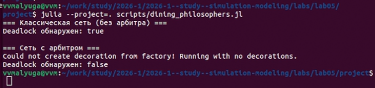{#fig-001 width=70%}

2. Два графика, на которых видны изменения маркировок во времени по обеим моделям([рис. @fig-002]): классической и с арбитром. Видно, что в классической модели ([рис. @fig-020]) спустя время все философы становятся голодными и никто не ест: происходит блокировка. В модели с арбитром ([рис. @fig-021]) видно, как постоянно меняются состояния у философов и блокировка не происходит .

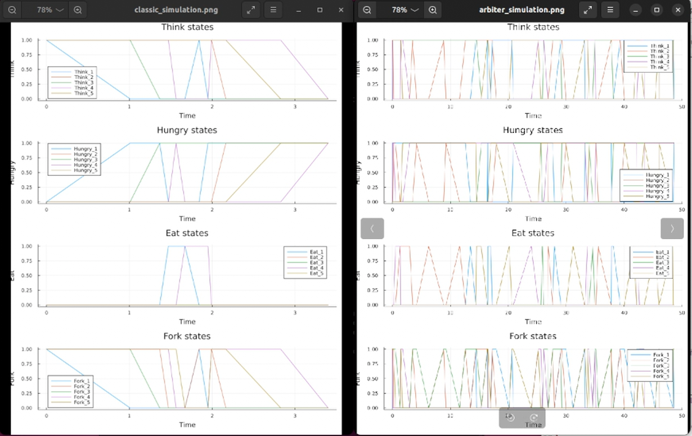{#fig-002 width=70%}

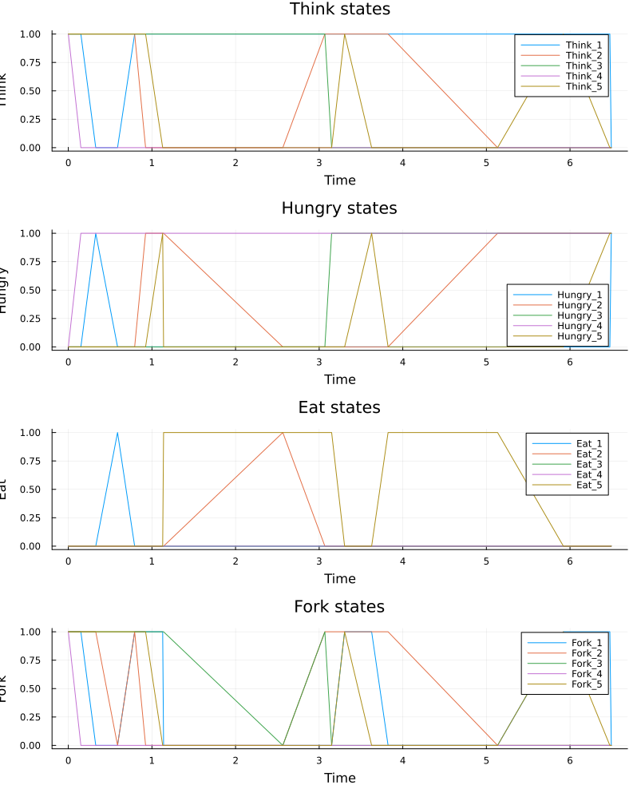{#fig-020 width=70%}

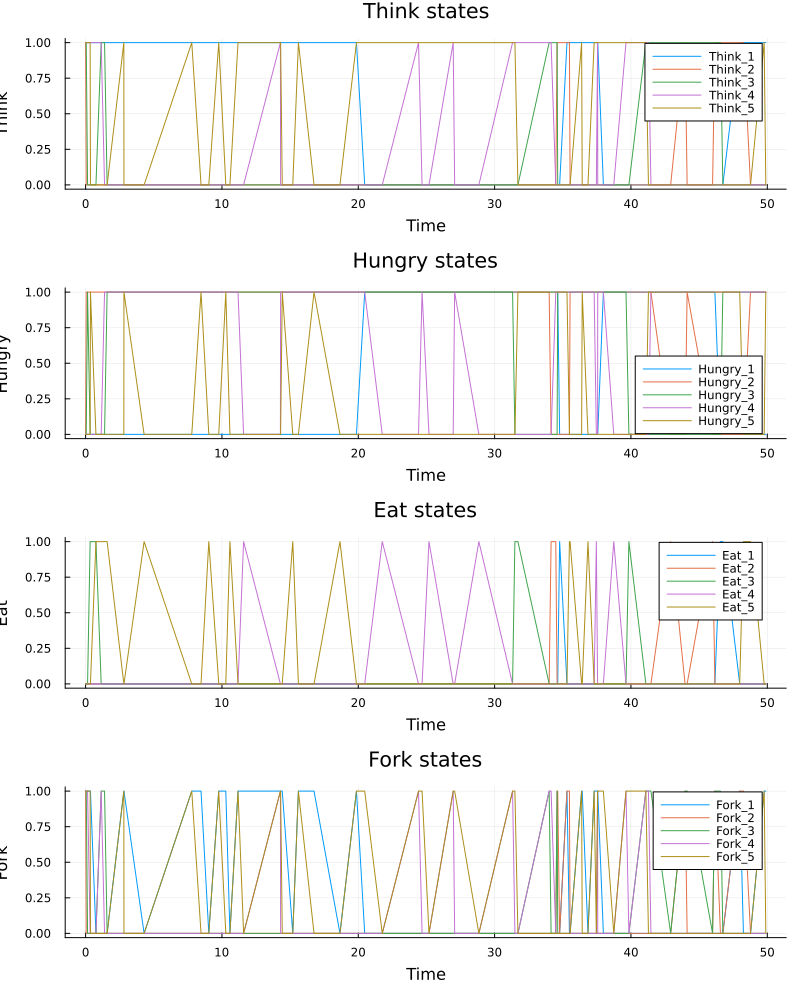{#fig-021 width=70%}

3. Две таблицы dining_classic и dining_arbiter, в которых отображены изменения маркировок состоний для каждого философа (0 или 1) в течение времени([рис. @fig-003], [рис. @fig-004]).

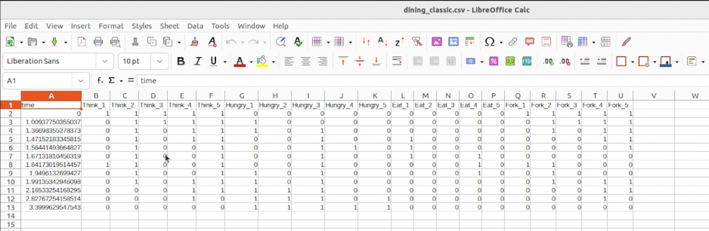{#fig-003 width=70%}

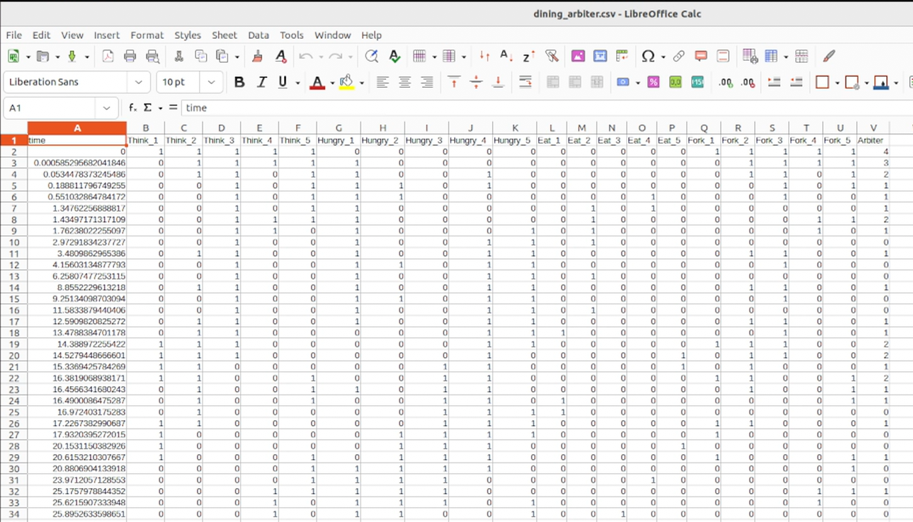{#fig-004 width=70%}

При выполнении скрипта dining_philosophers_animation.jl ([рис. @fig-005]) была получена анимация изменения состояний в классической модели с тремя философами ([рис. @fig-006]).

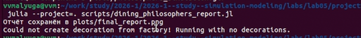{#fig-005 width=70%}

::: {.content-visible when-format="html"}
{#fig-006 width=70%}
:::

::: {.content-visible when-format="docx"}
{#fig-006 width=70%}
:::

::: {.content-visible when-format="pdf"}
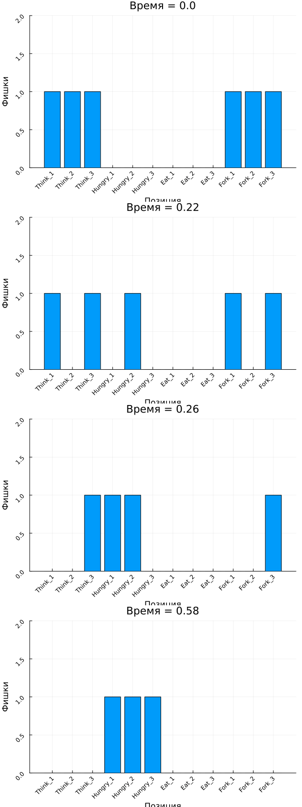{#fig-006 width=70%}
:::

При выполнении скрипта dining_philosophers_report.jl([рис. @fig-007]) был получен график, на котором изображено изменение маркировки Ест во времени для обеих моделей: классической и с арбитром([рис. @fig-008]).

{#fig-007 width=70%}

## Преобразование в литературный код 

Предложенные скрипты были преобразованы в литературный код([рис. @fig-008], [рис. @fig-009], [рис. @fig-010]).

{#fig-008 width=70%}

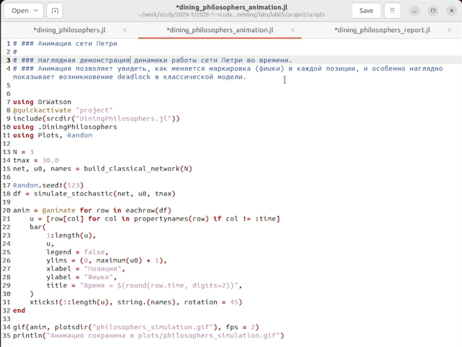{#fig-009 width=70%}

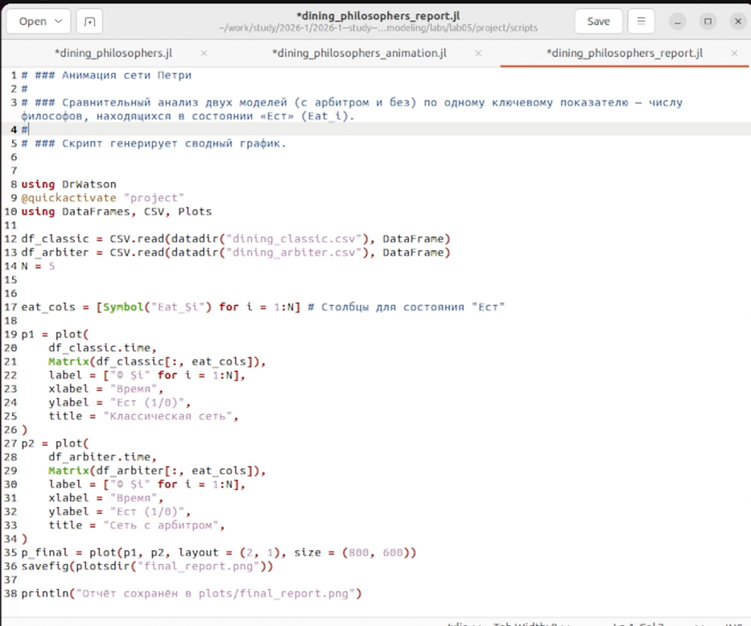{#fig-010 width=70%}

В итоге получила каталог с необходимы скриптами ([рис. @fig-011]).

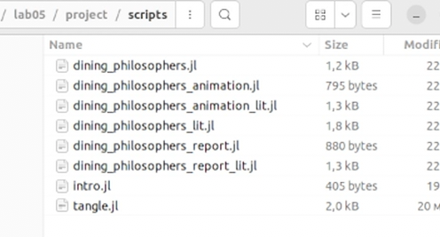{#fig-011 width=70%}

## Преобразование в производные форматы 

После преобразования в литературный код из скриптов были получены производные форматы с помощью скрипта tangle.jl ([рис. @fig-012]).

{#fig-012 width=70%}

Были проверены полученные ноутбуки на наличие ошибок ([рис. @fig-013]).

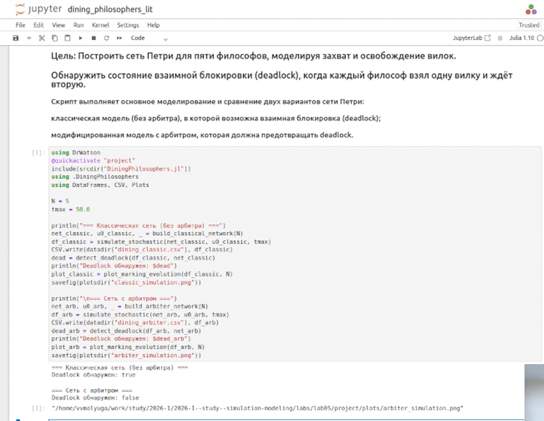{#fig-013 width=70%}

## Реализия скриптов







## Анализ 

Проведённое моделирование наглядно демонстрирует ключевую особенность
классической задачи «Обедающие философы» — неизбежность взаимной блокировки
при симметричной стратегии захвата вилок.

1. **Классическая сеть (без арбитра).** График `classic_simulation.png`
   ([рис. @fig-020]) показывает, что после некоторого времени все философы
   оказываются в состоянии `Hungry` (голодны) и ни один не может перейти
   в состояние `Eat` (ест). Это подтверждается консольным выводом
   `Deadlock обнаружен: true` ([рис. @fig-001]). Таблица `dining_classic.csv`
   фиксирует момент, после которого маркировка сети перестаёт изменяться —
   наступает deadlock.

2. **Сеть с арбитром.** Введение дополнительной позиции `Arbiter`
   с начальным количеством фишек `N-1` кардинально меняет динамику.
   График `arbiter_simulation.png` ([рис. @fig-021]) демонстрирует
   непрерывную смену состояний: философы поочерёдно думают, голодают и едят,
   и по крайней мере один из них всегда находится в состоянии `Eat`.
   Консольный вывод `Deadlock обнаружен: false` подтверждает
   работоспособность арбитра как механизма синхронизации.

3. **Сравнительный анализ.** График `final_report.png` ([рис. @fig-007])
   сводит воедино динамику состояния `Eat` для обеих моделей. Видно,
   что в классической сети линии всех философов падают до нуля и остаются
   на нуле, тогда как в сети с арбитром наблюдаются регулярные колебания.
   Это служит количественным доказательством эффективности выбранного
   метода предотвращения deadlock.

4. **Анимация.** GIF-анимация ([рис. @fig-006]) позволяет визуально
   проследить за перемещением фишек в классической модели и увидеть момент
   «застывания» системы, когда все переходы становятся неактивными.

Таким образом, полученные результаты полностью согласуются с теоретическими
ожиданиями и подтверждают, что даже минимальная модификация
(ограничение числа одновременно обедающих философов) способна исключить
взаимную блокировку.

# Выводы

В результате выполнения лабораторной работы №5 «Аппарат сетей Петри.
Моделирование задачи „Обедающие философы“» были решены все поставленные
задачи:

1. Построены две сети Петри для пяти философов: классическая
   (приводящая к deadlock) и с арбитром (предотвращающая deadlock).

2. Реализовано стохастическое моделирование с использованием алгоритма
   Гиллеспи; подтверждено возникновение взаимной блокировки в классической
   модели и её отсутствие в модели с арбитром.

3. Получены и проанализированы графики эволюции маркировок, сводный график
   состояния «Ест», а также создана анимация, наглядно иллюстрирующая
   динамику системы.

4. Код оформлен в стиле литературного программирования с использованием
   `Literate.jl`. Сгенерированы производные форматы: чистые скрипты,
   Jupyter Notebook и Quarto-документация.

5. Подготовлен отчёт в формате Quarto, содержащий все необходимые разделы,
   перекрёстные ссылки, библиографию и встроенные результаты моделирования.
   Отчёт успешно скомпилирован в форматы PDF, HTML и DOCX.

6. Рабочий репозиторий размещён на GitHub с соблюдением соглашения об
   именовании Denote, семантического версионирования и общепринятых
   коммитов.

**Итог:** Изучен математический аппарат сетей Петри как инструмент для
анализа параллельных процессов. На примере задачи «Обедающие философы»
показано, как формальная верификация позволяет выявить проблему deadlock
и предложить простое, но эффективное решение. Полученные навыки могут быть
применены при проектировании и анализе распределённых систем, баз данных
и многопоточных приложений.

# Список литературы{.unnumbered}

::: {#refs}
:::
