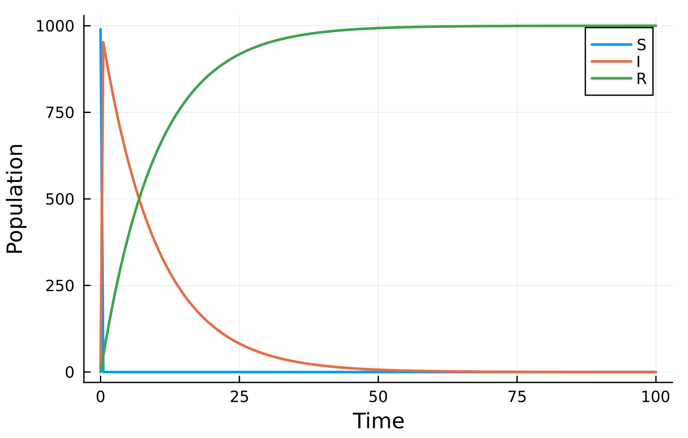
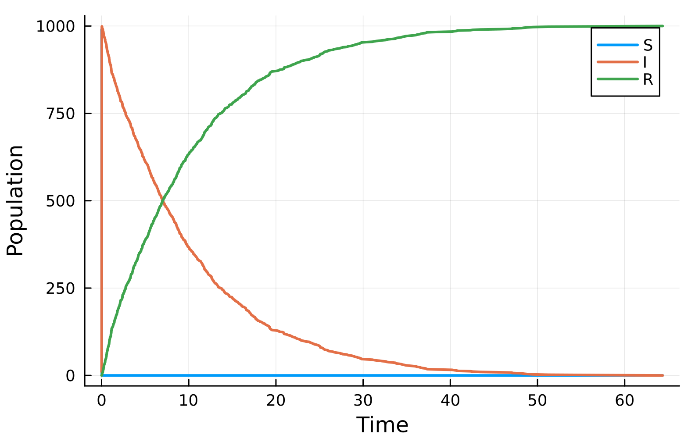
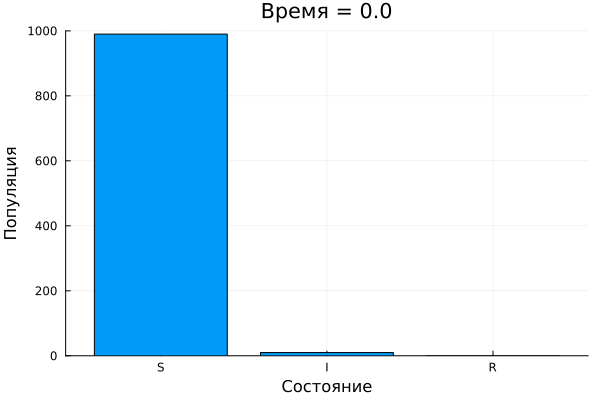
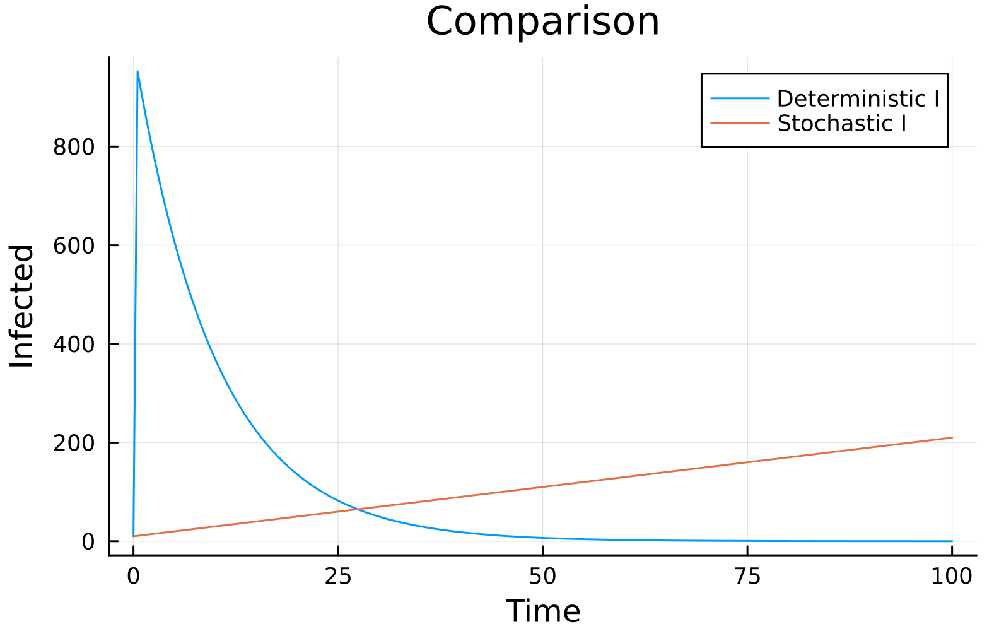

---
## Author
author:
  - name: "Малюга Валерия Васильевна"
    email: "1132236050@rudn.ru"
    affiliation: "Российский университет дружбы народов, Москва, РФ"
## Title
title: "Презентация по лабораторной работе №6"
subtitle: "Реализация основных моделей в подходе сетей Петри (SIR)"
license: "CC BY"
date: today
date-format: "YYYY-MM-DD"
bibliography: bib/cite.bib
csl: _resources/csl/gost-r-7-0-5-2008-numeric.csl
format:
  beamer:
    toc: true
    toc-title: "Содержание"
    number-sections: false
    number-depth: 1
    colorlinks: false
    toc-depth: 1
    aspectratio: 169
    section-titles: true
    incremental: false
    navigation: horizontal
    csquotes: true
    indent: true
    include-in-header:
      - file: _resources/tex/beamer.tex
    pdf-engine: xelatex                   
    mainfont: "DejaVu Serif"              
    monofont: "DejaVu Sans Mono"          
    babel-lang: russian
    babel-otherlangs: english
    cite-method: biblatex
    biblio-style: gost-numeric
    biblatexoptions:
      - backend=biber
      - langhook=extras
      - autolang=other*
    fig-format: png
    fig-dpi: 300
    fontsize: 9pt 
  revealjs:
    transition: slide
    margin: 0.2
    smaller: true
    slide-number: true
    output-ext: html
    theme: beige
    logo: _resources/image/logo_rudn.png
    fontsize: 1.1em  
    self-contained: true
    fig-format: png
    css: styles.css
execute:
  eval: false
  echo: false
---

## Докладчик

* **Малюга Валерия Васильевна**
* Студент НФИбд-01-23
* Российский университет дружбы народов им. П. Лумумбы
* <https://vvmalyuga.github.io/ru/>
* [1132236050@rudn.ru](mailto:1132236050@rudn.ru)

# Цели и задачи

1. Реализовать модель эпидемии SIR с помощью сетей Петри.
2. Провести детерминированную и стохастическую симуляции.
3. Исследовать влияние коэффициента заражения $\beta$.
4. Создать анимацию эпидемического процесса.
5. Подготовить отчёт с графиками и встроенной документацией.

# Задание

- Создать рабочий каталог и установить пакеты Julia.
- Реализовать модуль `SIRPetri.jl` с функциями модели.
- Выполнить базовый прогон, сканирование $\beta$, анимацию и отчёт.
- Преобразовать код в литературный стиль.
- Сгенерировать чистые скрипты, Quarto-документы и Jupyter-ноутбуки.
- Интегрировать всё в итоговый отчёт.

# Теоретическое введение

## Сети Петри

Сеть Петри – математический аппарат для моделирования дискретных систем, предложенный К. А. Петри в 1962 году [@petri1962kommunikation].

- **Позиции** – пассивные элементы, хранят фишки (состояние).
- **Переходы** – активные элементы, события.
- **Дуги** соединяют позиции и переходы.
- **Маркировка** – текущее распределение фишек.

Срабатывание перехода изменяет маркировку: забирает фишки из входных позиций и добавляет в выходные.

## Модель SIR

Классическая эпидемиологическая модель (Kermack & McKendrick, 1927) [@kermack1927].

Популяция делится на три группы:
- $S$ – восприимчивые,
- $I$ – инфицированные,
- $R$ – выздоровевшие (иммунные).

Динамика описывается системой ОДУ:
$$
\frac{dS}{dt} = -\beta S I,\quad
\frac{dI}{dt} = \beta S I - \gamma I,\quad
\frac{dR}{dt} = \gamma I.
$$

## SIR как сеть Петри

Реализована двумя переходами:
- **infection**: $S + I \to I + I$ (скорость $\beta$)
- **recovery**: $I \to R$ (скорость $\gamma$)

Начальная маркировка: $S=990$, $I=10$, $R=0$.

Два подхода к симуляции:
- **Детерминированный** – численное решение ОДУ методом Tsit5.
- **Стохастический** – прямой метод Гиллеспи (SSA), учитывающий случайные флуктуации.

# Выполнение работы

## Структура проекта

- Проект DrWatson в `lab06/project/`.
- Модуль `SIRPetri.jl` реализует построение сети, детерминированное и стохастическое моделирование, визуализацию.
- Скрипты размещены в `scripts/`, данные – в `data/`, графики – в `plots/`.

## Базовый прогон

Скрипт `sirpetri_run.jl` выполняет два типа симуляций с параметрами $\beta=0.3$, $\gamma=0.1$, $T=100$.  
Результаты сохраняются в `sir_det.csv` и `sir_stoch.csv`.

## Детерминированная динамика

{width=60%}

*Классический колоколообразный пик инфицированных и выход выздоровевших на плато.*

## Стохастическая динамика

{width=60%}

*Небольшие случайные флуктуации, но общая форма близка к детерминированной кривой.*

## Сканирование параметра $\beta$

- Диапазон $\beta$: от $0.1$ до $0.8$, шаг $0.05$, $\gamma=0.1$ фиксировано.
- Для каждого значения вычислены максимальное число инфицированных $I_{\max}$ и конечное число выздоровевших $R(\infty)$.
- Результаты собраны в `sir_scan.csv`.

## Влияние $\beta$ на эпидемию

{width=60%}

*Порог около $\beta\approx0.15$: при меньших значениях эпидемия затухает.*

## Анимация процесса

::: {.content-hidden when-format="beamer"}
{width=60%}
:::

::: {.content-hidden when-format="revealjs"}
{width=60%}
:::

*Кадры столбчатой диаграммы показывают волну инфекции.*

## Сравнение детерминированной и стохастической $I(t)$

{width=60%}

*При большой популяции стохастическая траектория практически совпадает с детерминированной.*

## Чувствительность пика $I$ к $\beta$

{width=60%}

*Монотонный рост пика с увеличением $\beta$.*

# Анализ результатов

- Детерминированная модель даёт колоколообразный пик $I$, согласующийся с классической теорией SIR.
- Стохастическая симуляция вносит шум, но при $N=1000$ различия незначительны.
- Обнаружен пороговый эффект: при $\beta \approx 0.15$ ($R_0 \approx 1.5$) эпидемия начинает развиваться.
- Анимация наглядно показывает распространение инфекции и спад.
- Сравнительный график подтверждает близость двух подходов.

# Выводы

1. Модель SIR успешно реализована в формализме сетей Петри.
2. Проведены детерминированная и стохастическая симуляции, исследовано влияние $\beta$.
3. Создана анимация и полный набор графиков для анализа.
4. Код оформлен в стиле литературного программирования, сгенерированы все производные форматы.
5. Результаты воспроизводимы, отчёт скомпилирован в трёх форматах (PDF, HTML, DOCX).

# Список литературы

::: {#refs}
:::
