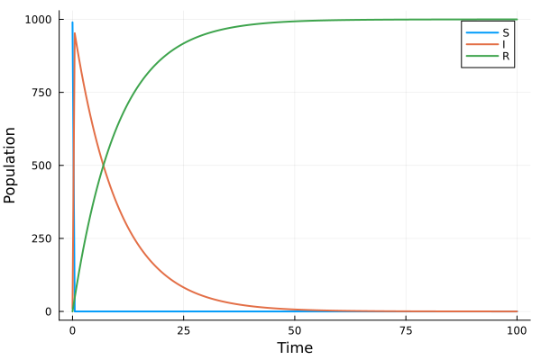
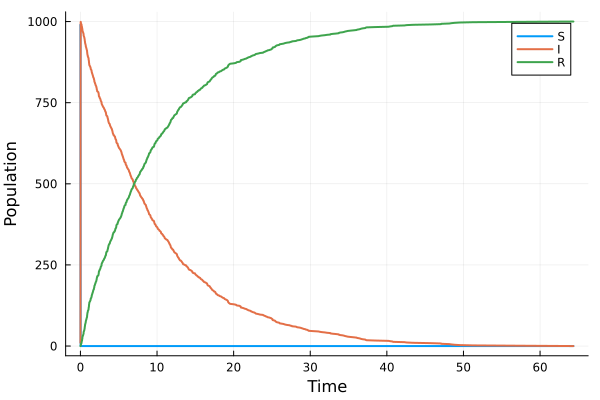
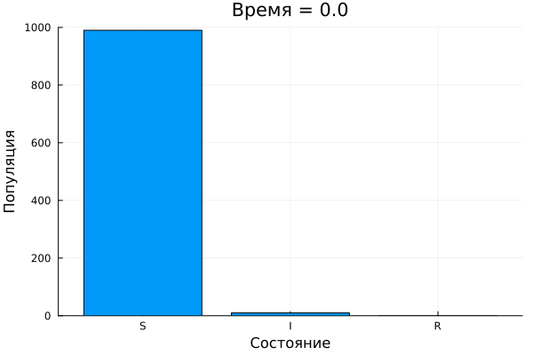

# Цель работы

1. Реализовать модель эпидемии SIR с помощью сетей Петри.
2. Провести детерминированную (ODE) и стохастическую (алгоритм Гиллеспи) симуляции.
3. Исследовать влияние коэффициента заражения $\beta$ на динамику эпидемии.
4. Создать анимацию эпидемического процесса.
5. Преобразовать код в литературный стиль и сгенерировать производные форматы.
6. Подготовить отчёт с графиками, анимацией и встроенной документацией.

# Задание

1. Создать рабочий каталог для кода, установить необходимые пакеты Julia.
2. Реализовать модуль `SIRPetri.jl` с функциями построения сети, симуляции и визуализации.
3. Выполнить базовый прогон, сохранить данные и построить графики.
4. Провести параметрическое сканирование $\beta$, визуализировать зависимость пика заболеваемости и итоговой доли выздоровевших.
5. Создать анимацию детерминированной динамики.
6. Сгенерировать итоговые сравнительные графики.
7. Преобразовать код в литературный стиль, сгенерировать чистые скрипты, Jupyter-ноутбуки и Quarto-документы с помощью `tangle.jl`.
8. Выполнить код в Jupyter-ноутбуках, интегрировать результаты в отчёт.

# Теоретическое введение

## Сети Петри

Сеть Петри — математический аппарат для моделирования дискретных систем, предложенный Карлом Адамом Петри в 1962 году [@petri1962kommunikation]. Она представляет собой двудольный ориентированный граф с двумя типами вершин:

- *позиции* (places) — пассивные элементы, описывающие состояние системы (содержат фишки — маркеры);
- *переходы* (transitions) — активные элементы, моделирующие события.

Дуги соединяют позиции и переходы, показывая, какие условия необходимы для срабатывания событий и как изменяется состояние после их наступления. Текущее распределение фишек по позициям называется *маркировкой*. Срабатывание разрешённого перехода приводит к мгновенному изменению маркировки.

Формально сеть Петри задаётся четвёркой $N = (P, T, F, M_0)$, где $P$ — множество позиций, $T$ — множество переходов, $F \subseteq (P \times T) \cup (T \times P)$ — множество дуг, $M_0: P \to \mathbb{N}$ — начальная маркировка [@murata1989petri].

## Модель SIR

Модель SIR (Susceptible–Infected–Recovered) — классическая компартментальная модель эпидемиологии, предложенная Кермаком и Маккендриком в 1927 году [@kermack1927]. Популяция разделяется на три группы:

- $S$ — восприимчивые,
- $I$ — инфицированные,
- $R$ — выздоровевшие (приобретшие иммунитет или умершие).

Динамика описывается системой обыкновенных дифференциальных уравнений:

$$
\begin{aligned}
\frac{dS}{dt} &= -\beta S I,\\
\frac{dI}{dt} &= \beta S I - \gamma I,\\
\frac{dR}{dt} &= \gamma I,
\end{aligned}
$$

где $\beta$ — коэффициент заражения (infection rate), $\gamma$ — скорость выздоровления (recovery rate). Базовое репродуктивное число $R_0 = \beta / \gamma$ определяет, возникнет ли эпидемия ($R_0 > 1$) или затухнет ($R_0 < 1$).

## Представление модели SIR сетью Петри

В данной работе модель реализована с помощью двух переходов:

- `infection`: $S + I \to I + I$ (скорость $\beta$),
- `recovery`: $I \to R$ (скорость $\gamma$).

Начальная маркировка: $S = 990$, $I = 10$, $R = 0$. Соответствующая сеть Петри создаётся в модуле `SIRPetri.jl` с использованием пакета `AlgebraicPetri`.

Для симуляции используются:
- детерминированный подход — решение ОДУ методом Tsit5 (пакет `OrdinaryDiffEq`);
- стохастический подход — прямой метод Гиллеспи (Stochastic Simulation Algorithm), реализованный вручную.

# Выполнение лабораторной работы

## Подготовка рабочего пространства

В каталоге `lab06` был создан проект DrWatson, активированы необходимые пакеты: `AlgebraicPetri`, `Catlab`, `OrdinaryDiffEq`, `Plots`, `DataFrames`, `CSV`, `Random`, `Literate`, `IJulia`. Код модуля сохранён в `src/SIRPetri.jl`.

## Базовый прогон модели SIR

Запущен скрипт `sirpetri_run.jl` с параметрами $\beta = 0.3$, $\gamma = 0.1$, $T = 100$. Выполнены детерминированная и стохастическая симуляции, результаты сохранены в файлы `sir_det.csv` и `sir_stoch.csv`.

Полученные графики динамики численности групп представлены на рис. [-@fig-det] и [-@fig-stoch].

{#fig-det width=80%}

{#fig-stoch width=80%}

Стохастическая траектория демонстрирует небольшие флуктуации, но сохраняет общую форму, близкую к детерминированной кривой, что ожидаемо при большом размере популяции.

## Исследование влияния параметра $\beta$

Скрипт `sirpetri_scan_parameters.jl` провёл серию детерминированных симуляций для $\beta$ от $0.1$ до $0.8$ с шагом $0.05$ при фиксированном $\gamma = 0.1$. Для каждого значения вычислены пик инфицированных $I_{\max}$ и конечная доля выздоровевших $R(\infty)$. Результаты сохранены в `sir_scan.csv` и визуализированы на рис. [-@fig-scan].

{#fig-scan width=80%}

График наглядно показывает пороговый характер эпидемии: при $\beta \lessapprox 0.15$ вспышка не развивается ($I_{\max} \approx 0$), после чего показатели быстро растут и выходят на насыщение.

## Анимация эпидемического процесса

Скрипт `sirpetri_animate.jl` создал анимацию изменения численности групп $S, I, R$ во времени. Анимация сохранена как `sir_animation.gif`.

::: {.content-visible when-format="html"}
{#fig-anim width=80%}
:::

::: {.content-visible when-format="docx"}
{#fig-anim width=80%}
:::

::: {.content-visible when-format="pdf"}
{#fig-anim width=80%}
:::

## Итоговые сравнительные графики

Скрипт `sirpetri_report.jl` загрузил сохранённые данные и построил два отчётных графика: сравнение детерминированной и стохастической кривых $I(t)$ (рис. [-@fig-comp]) и зависимость пика $I$ от $\beta$ (рис. [-@fig-sens]).

{#fig-comp width=80%}

{#fig-sens width=80%}

## Преобразование в литературный стиль и генерация производных форматов

Исходные скрипты были дополнены описательным текстом в духе литературного программирования (Literate.jl). С помощью универсального скрипта `tangle.jl` из каждого литературного файла были сгенерированы:

- чистый исполняемый скрипт,
- документ Quarto (`.qmd`),
- Jupyter-ноутбук (`.ipynb`).

Все сгенерированные Jupyter-ноутбуки были проверены на выполнимость, графики и анимация отображаются корректно.

## Реализация скриптов

Ниже представлены Quarto-документы, сгенерированные из литературных скриптов модели SIR с сетями Петри.









## Анализ результатов

Проведённое моделирование полностью согласуется с теоретическими представлениями о динамике эпидемии.

1. **Базовый прогон.** Детерминированная кривая демонстрирует классический колоколообразный пик инфицированных, за которым следует выход числа выздоровевших на плато. Стохастическая траектория подтверждает адекватность модели при больших $N$ и вносит элемент непредсказуемости, характерный для реальных систем.

2. **Влияние $\beta$.** График зависимости пика $I$ и конечного $R$ от $\beta$ чётко показывает пороговое поведение: при $R_0 \lesssim 1$ эпидемия не возникает, а с ростом $\beta$ её масштаб быстро увеличивается до полного охвата популяции.

3. **Анимация** даёт наглядное представление о волне инфекции, проходящей через популяцию.

4. **Сравнительный график** $I(t)$ подчёркивает, что даже при наличии шума стохастическая модель сохраняет основные черты детерминированной, что важно для прогнозирования.

Таким образом, модель SIR на основе сетей Петри успешно воспроизводит ключевые особенности эпидемического процесса и может служить основой для более сложных сценариев.

# Выводы

В ходе выполнения лабораторной работы №6 были решены все поставленные задачи:

- Реализована модель SIR с использованием формализма сетей Петри (пакет `AlgebraicPetri`).
- Проведены детерминированная и стохастическая симуляции, результаты сохранены и визуализированы.
- Исследовано влияние коэффициента заражения $\beta$; выявлен пороговый характер.
- Создана анимация динамики эпидемии.
- Весь код оформлен в литературном стиле, сгенерированы чистые скрипты, Quarto-документы и Jupyter-ноутбуки.
- Подготовлен настоящий отчёт, включающий все графики, анимацию и встроенные Quarto-файлы.

Полученные навыки могут быть применены для моделирования и анализа других динамических систем, описываемых сетями Петри.

# Список литературы{.unnumbered}

::: {#refs}
:::
