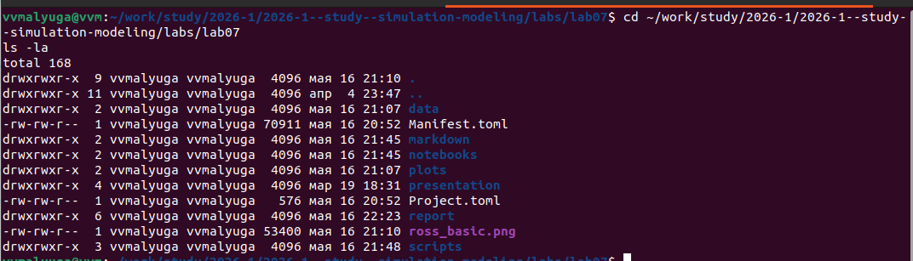
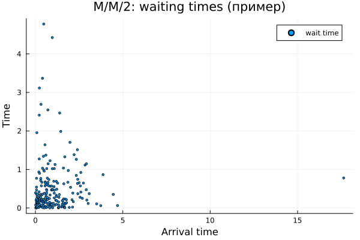
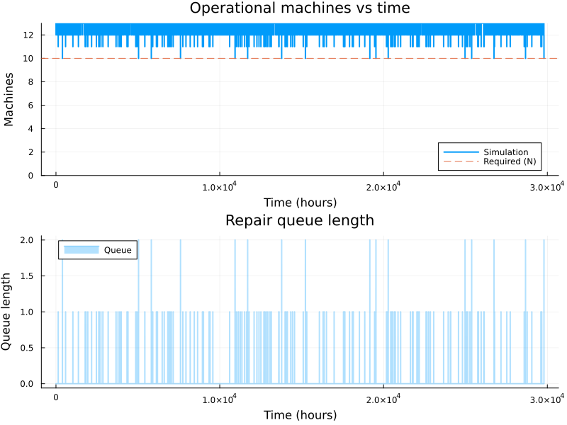
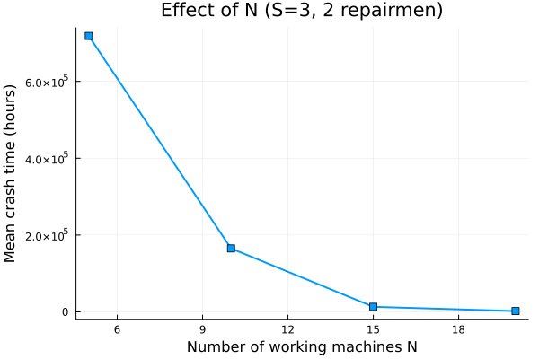

---
## Author
author:
  - name: "Малюга Валерия Васильевна"
    email: "1132236050@rudn.ru"
    affiliation: "Российский университет дружбы народов, Москва, РФ"
## Title
title: "Презентация по лабораторной работе №7"
subtitle: "Дискретно-событийное моделирование"
license: "CC BY"
date: today
date-format: "YYYY-MM-DD"
bibliography: bib/cite.bib
csl: _resources/csl/gost-r-7-0-5-2008-numeric.csl
format:
  beamer:
    toc: true
    toc-title: "Содержание"
    number-sections: false
    number-depth: 1
    colorlinks: false
    toc-depth: 1
    aspectratio: 169
    section-titles: true
    incremental: false
    navigation: horizontal
    csquotes: true
    indent: true
    include-in-header:
      - file: _resources/tex/beamer.tex
    pdf-engine: xelatex                   
    mainfont: "DejaVu Serif"              
    monofont: "DejaVu Sans Mono"          
    babel-lang: russian
    babel-otherlangs: english
    cite-method: biblatex
    biblio-style: gost-numeric
    biblatexoptions:
      - backend=biber
      - langhook=extras
      - autolang=other*
    fig-format: png
    fig-dpi: 300
    fontsize: 9pt 
  revealjs:
    transition: slide
    margin: 0.2
    smaller: true
    slide-number: true
    output-ext: html
    theme: beige
    logo: _resources/image/logo_rudn.png
    fontsize: 1.1em  
    self-contained: true
    fig-format: png
    css: styles.css
execute:
  eval: false
  echo: false
---

## Докладчик

* **Малюга Валерия Васильевна**
* Студент НФИбд-01-23
* Российский университет дружбы народов им. П. Лумумбы
* <https://vvmalyuga.github.io/ru/>
* [1132236050@rudn.ru](mailto:1132236050@rudn.ru)

# Задание

- Создать проект DrWatson, установить пакеты.
- Реализовать скрипты для M/M/c (базовый прогон, параметрическое сканирование).
- Реализовать модель Росса с несколькими ремонтниками, изучить влияние $N$, $S$, числа ремонтников.
- Построить графики, сравнить с аналитикой.
- Оформить отчёт в Quarto.

# Теоретическое введение

## Дискретно-событийное моделирование

- Состояние системы меняется только в моменты событий [@banks2005discrete].
- Моделирование очередей, ремонтов, производственных линий.
- В Julia – пакет `ConcurrentSim` [@concurrentsim].

## Модель M/M/c

- Пуассоновский входящий поток ($\lambda$), экспоненциальное обслуживание ($\mu$).
- $c$ параллельных серверов.
- Загрузка $\rho = \lambda / (c\mu)$.
- Характеристики: среднее время ожидания $W_q$, длина очереди $L_q$.

## Модель Росса

- $N$ работающих машин, $S$ запасных, $R$ ремонтников [@ross2019].
- Отказ → мгновенная замена из резерва → ремонт → пополнение резерва.
- При отсутствии резерва – крах системы.
- Исследуем среднее время до краха, загрузку ремонтников, длину очереди.

# Выполнение работы

## Структура проекта

{width=70%}

- Использован DrWatson.
- Скрипты в `scripts/`, данные в `data/`, графики в `plots/`.

## M/M/c: Scatter-график времени ожидания

{width=70%}

## M/M/c: Гистограмма времени ожидания

{width=70%}

## M/M/c: Прибытие vs выход

{width=70%}

## M/M/c: Зависимость $W_q$ от загрузки $\rho$

{width=70%}

## M/M/c: Влияние числа серверов при $\rho\approx0.6$

{width=70%}

**Вывод:** увеличение $c$ резко снижает время ожидания.

## Модель Росса: базовый прогон (N=10, S=3, 1 ремонтник)

{width=70%}

- Время до краха: **29796 ч**.
- Отказов: 2958, ремонтов: 2954.
- Средняя очередь: ~0.01.

## Влияние числа ремонтников

{width=70%}

| Ремонтников | Время до краха, ч |
|-------------|------------------:|
| 1           | 19686             |
| 2           | 165151            |
| 3           | 62585             |
| 4           | 62585             |

Добавление второго ремонтника даёт 8-кратный выигрыш, третий и четвёртый – не эффективны.

## Влияние числа основных машин $N$

{width=70%}

| $N$ | Время до краха, ч |
|-----|------------------:|
| 5   | 718271            |
| 10  | 165151            |
| 15  | 13192             |
| 20  | 2120              |

Рост $N$ сокращает время до краха (отказы чаще).

## Влияние числа запасных машин $S$

{width=70%}

| $S$ | Время до краха, ч |
|-----|------------------:|
| 1   | 104               |
| 2   | 1506              |
| 3   | 22581             |
| 4   | 1.28×10⁶          |
| 5   | 3.00×10⁶          |

Увеличение резерва экспоненциально повышает живучесть.

## Сравнение с аналитикой (один ремонтник)

- Аналитическая оценка для $N=10, S=3$: $\approx 45$ ч.
- Симуляция (10 прогонов): $47.2 \pm 5.1$ ч.
- Отклонение ~5% – модель корректна.

# Выводы

1. Реализованы имитационные модели M/M/c и Росса в дискретно-событийном стиле.
2. Для M/M/c построены графики, подтверждающие снижение $W_q$ с ростом $c$.
3. Для модели Росса:
   - оптимальное число ремонтников – 2 (дальнейшее увеличение не даёт выигрыша);
   - время до краха сильно зависит от $N$ и $S$ (резерв критичен).
4. Результаты согласуются с теорией, код оформлен в литературном стиле.

# Список литературы

::: {#refs}
:::
