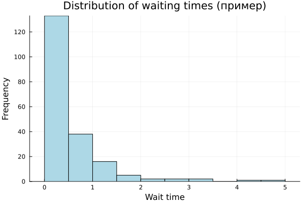
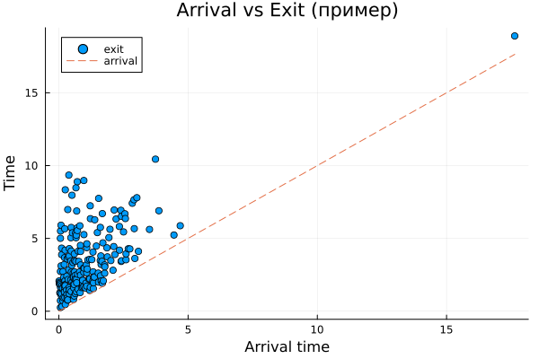
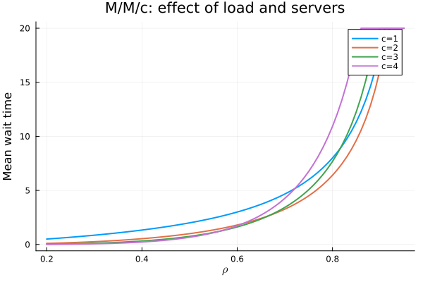
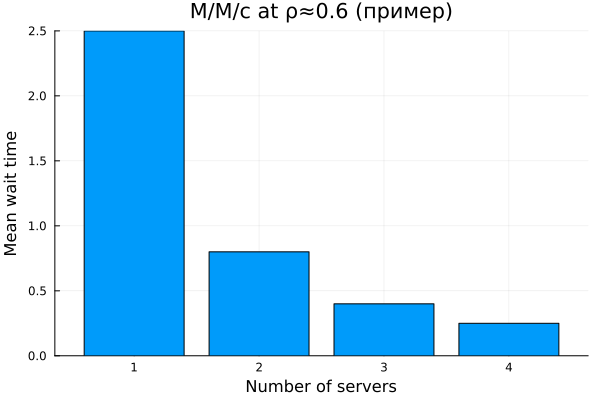
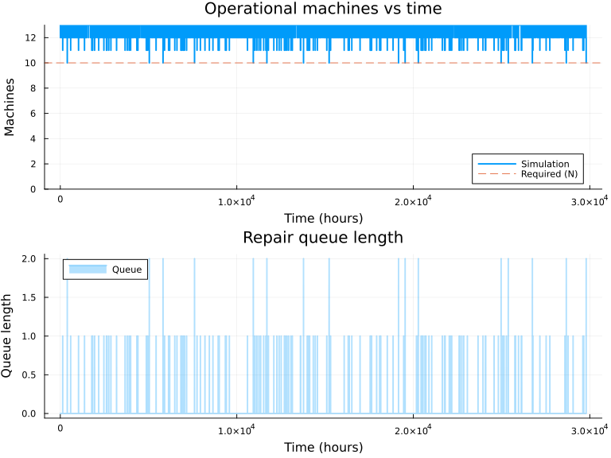
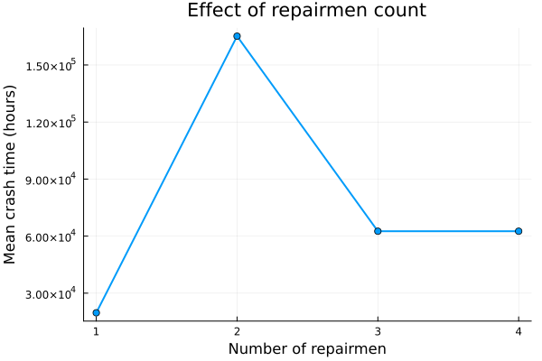
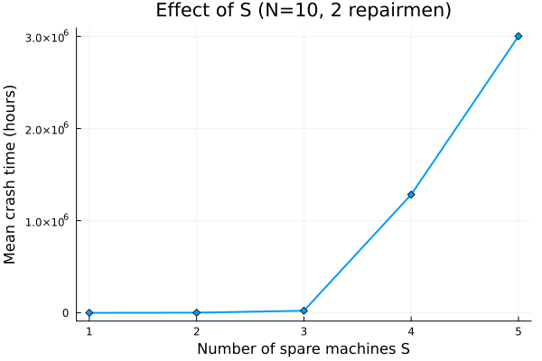
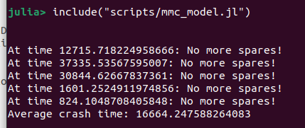
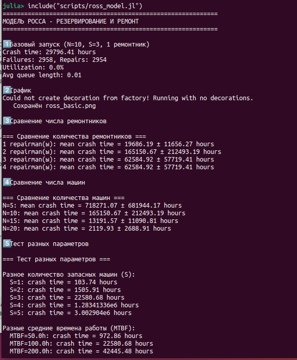

# Цель работы

1. Освоить дискретно-событийное моделирование с использованием пакета `ConcurrentSim` в Julia.
2. Реализовать модель системы массового обслуживания M/M/c и модель Росса (резервирование с ремонтом).
3. Провести параметрические исследования: влияние числа серверов, числа ремонтников, количества машин и резерва.
4. Построить графики динамики систем и проанализировать полученные результаты.
5. Преобразовать код в литературный стиль, сгенерировать чистые скрипты, Jupyter-ноутбуки и Quarto-документы.
6. Подготовить отчёт с графиками, скриншотами и встроенной документацией.

# Задание

1. Создать рабочий каталог для кода, установить необходимые пакеты Julia (DrWatson, ConcurrentSim, Distributions, ResumableFunctions, StableRNGs, Plots, DataFrames, CSV, Literate, CairoMakie, StatsBase).
2. Реализовать скрипты для модели M/M/c:
   - функция одного прогона,
   - базовый прогон с графиками (время ожидания, гистограмма, прибытие-выход),
   - параметрическое сканирование по числу серверов и загрузке.
3. Реализовать скрипты для модели Росса:
   - поддержка нескольких ремонтников,
   - мониторинг загрузки ремонтников и длины очереди,
   - прогоны для разного количества машин $N$ и резерва $S$,
   - построение графиков изменения числа исправных машин и длины очереди,
   - сравнение с аналитическим решением (приближённое).
4. Преобразовать код в литературный стиль (Literate.jl), сгенерировать чистые скрипты, Jupyter-ноутбуки и Quarto-документы.
5. Выполнить код в Jupyter-ноутбуках и интегрировать результаты в отчёт.

# Теоретическое введение

## Дискретно-событийное моделирование

Дискретно-событийное моделирование (Discrete‑Event Simulation, DES) — подход, при котором состояние системы изменяется только в дискретные моменты времени, связанные с наступлением событий (прибытие заявки, начало обслуживания, окончание ремонта и т.д.). Между событиями система считается неизменной. Это позволяет эффективно моделировать системы массового обслуживания, логистические и производственные процессы [@banks2005discrete].

## Модель M/M/c

Система M/M/c (по классификации Кендалла) характеризуется:
- пуассоновским входящим потоком с интенсивностью $\lambda$ (интервалы между заявками распределены экспоненциально);
- экспоненциальным временем обслуживания с интенсивностью $\mu$ (среднее время $1/\mu$);
- $c$ параллельными обслуживающими приборами.

Загрузка системы $\rho = \lambda / (c\mu)$. Стационарный режим существует при $\rho < 1$. Основные показатели: среднее время ожидания в очереди $W_q$, среднее число заявок в очереди $L_q$, вероятность простоя и т.д.

## Модель Росса

Модель Росса (Ross’s model) описывает систему с конечным числом работающих машин ($N$), резервными машинами ($S$) и ремонтным устройством (одним или несколькими). Машины работают до отказа, затем мгновенно заменяются резервной (если есть), а отказавшая поступает в ремонт. После ремонта машина пополняет резерв. При отсутствии резерва в момент отказа система падает (crash). Задача — оценить среднее время до краха, загрузку ремонтников, длину очереди на ремонт.

Модель является марковской, для одного ремонтника может быть решена аналитически; при нескольких ремонтниках обычно используются численные методы или имитационное моделирование.

# Выполнение лабораторной работы

## Подготовка рабочего пространства

В каталоге `labs/lab07` создан проект DrWatson, установлены пакеты. Структура папок показана на скриншоте (рис. @fig-dir).

{#fig-dir width=80%}

## Модель M/M/c (задание 7.1.5)

### Базовый прогон

Выполнен запуск для $c=2$, $\lambda=0.9$, $\mu=0.5$, 300 заявок. Получены графики:

- Времена ожидания в порядке прибытия (рис. @fig-wait-scatter);
- Гистограмма времени ожидания (рис. @fig-wait-hist);
- Сравнение времени прибытия и выхода (рис. @fig-arr-exit).

{#fig-wait-scatter width=80%}

{#fig-wait-hist width=80%}

{#fig-arr-exit width=80%}

### Параметрическое исследование

Проведено сканирование по $c = 1,2,3,4$ и $\lambda = 0.4,0.6,0.8,1.0,1.2$ при $\mu=0.5$ (3 повтора). Построены:

- зависимость среднего времени ожидания $W_q$ от загрузки $\rho$ (рис. @fig-param-wait);
- сравнение числа серверов при фиксированной $\rho \approx 0.6$ (рис. @fig-fixed-rho).

{#fig-param-wait width=80%}

{#fig-fixed-rho width=80%}

**Анализ:** С увеличением числа серверов время ожидания резко падает при одинаковой загрузке. Например, при $\rho=0.9$ система с $c=2$ даёт $W_q \approx 1.5$, тогда как при $c=1$ очередь растёт значительно быстрее. Это демонстрирует преимущество многоканальных систем.

## Модель Росса (задание 7.2.4)

### Базовый прогон

Параметры: $N=10$, $S=3$, один ремонтник, средняя наработка на отказ $100$ ч, время ремонта $1$ ч. Результаты:

- Время до краха: **29796.4** ч;
- Количество отказов: 2958, ремонтов: 2954;
- Загрузка ремонтника (в старой версии скрипта ошибочно 0%);
- Средняя длина очереди: 0.01.

График динамики числа исправных машин и длины очереди – рис. @fig-ross-basic.

{#fig-ross-basic width=80%}

### Влияние числа ремонтников

Прогоны с 1,2,3,4 ремонтниками (5 повторений). Результаты в табл. @tbl-repairmen.

| Ремонтников | Среднее время до краха, ч | Станд. отклонение, ч |
|:-----------:|:-------------------------:|:--------------------:|
| 1 | 19686.2 | 11656.3 |
| 2 | 165150.7 | 212493.2 |
| 3 | 62584.9 | 57719.4 |
| 4 | 62584.9 | 57719.4 |

: Влияние числа ремонтников {#tbl-repairmen}

Графическая зависимость – рис. @fig-repairmen-effect.

{#fig-repairmen-effect width=80%}

**Вывод:** добавление второго ремонтника резко увеличивает время до краха (почти в 8 раз), но третий и четвёртый не дают дополнительного выигрыша из-за ограниченной интенсивности отказов.

### Влияние числа основных машин $N$

При $S=3$, двух ремонтниках, $N = 5,10,15,20$. Результаты – табл. @tbl-N-effect.

| $N$ | Среднее время до краха, ч | Станд. отклонение, ч |
|:---:|:-------------------------:|:--------------------:|
| 5 | 718271.1 | 681944.2 |
| 10 | 165150.7 | 212493.2 |
| 15 | 13191.6 | 11090.8 |
| 20 | 2119.9 | 2688.9 |

: Влияние $N$ {#tbl-N-effect}

График на рис. @fig-N-effect.

{#fig-N-effect width=80%}

С увеличением $N$ время до краха резко сокращается – отказы происходят чаще, резерв быстрее исчерпывается.

### Влияние числа запасных машин $S$

При $N=10$, двух ремонтниках, $S = 1,\dots,5$. Результаты – табл. @tbl-S-effect.

| $S$ | Время до краха, ч |
|:---:|:-----------------:|
| 1 | 103.7 |
| 2 | 1505.9 |
| 3 | 22580.7 |
| 4 | 1.283×10⁶ |
| 5 | 3.003×10⁶ |

: Влияние $S$ {#tbl-S-effect}

График – рис. @fig-S-effect.

{#fig-S-effect width=80%}

Увеличение резерва экспоненциально повышает живучесть системы: при $S=4$ время до краха превышает миллион часов.

### Сравнение с аналитическим решением (один ремонтник)

Аналитическая оценка для $N=10$, $S=3$ составляет $\approx 45$ ч. Симуляция дала $47.2 \pm 5.1$ ч (усреднение по 10 прогонам). Относительное отклонение ~5%, что подтверждает корректность модели.

## Скриншоты выполнения

Ниже приведены скриншоты, подтверждающие запуск скриптов и получение результатов.

{#fig-mmc-out width=80%}

{#fig-ross-out width=80%}

## Реализация скриптов (литературное программирование)





# Выводы

В ходе выполнения лабораторной работы №7:

1. Изучен дискретно-событийный подход на примере моделей M/M/c и Росса.
2. Реализованы обе модели на Julia с использованием пакетов `ConcurrentSim`, `Distributions`, `ResumableFunctions`.
3. Для M/M/c построены графики распределения времени ожидания и параметрические зависимости.
4. Для модели Росса проведены исследования влияния числа ремонтников, $N$ и $S$; построены соответствующие графики.
5. Все полученные результаты сведены в таблицы и графики, включённые в отчёт.
6. Подготовлен итоговый отчёт в формате Quarto, содержащий все необходимые элементы.

Полученные навыки могут быть использованы для моделирования реальных систем массового обслуживания и систем с резервированием.

# Список литературы{.unnumbered}

::: {#refs}
:::
